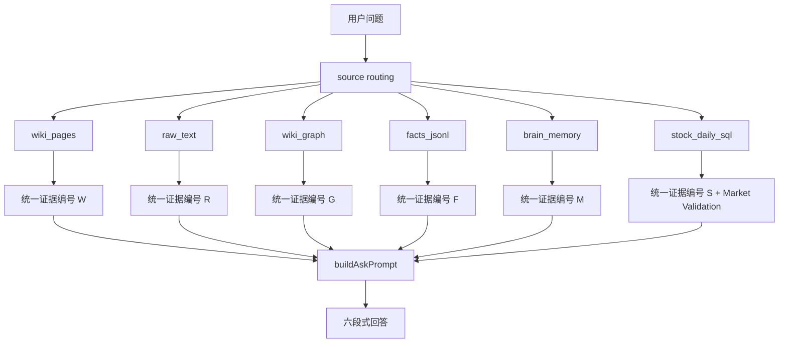

# Trading Review Wiki Codex CLI

> 面向交易复盘知识库的 Codex CLI 工具集：把 raw 资料、正式 wiki、图谱、长期记忆、结构化事实和行情 SQL 组织成一个可检索、可验证、可迭代的交易研究系统。

作者：杰哥｜公众号：`ymj0418`
协作者：[@sowelswl](https://github.com/sowelswl)

这个仓库现在的主定位不是单纯桌面应用，而是围绕 live 知识库运行的一套自动化 CLI：

- 多源 RAG 问答：`wiki / raw / graph / facts / brain / stock_daily_sql`
- App-grade 知识摄入：`api-run -> finalize -> apply --write`
- 盘前预测与盘后验证：`daily-loop`
- 插件优先公司深度研究：`company-research --deep --plugin-led`
- 长期纠错与自训练：`brain / market-validate / self-train`
- Wiki 维护和检索质量治理：`hygiene / ask eval / vector maintenance`
- Gangtise/OpenClaw 主题资料导出与摄入辅助

## Desktop App Builds

If you want the earlier Tauri desktop app instead of the Codex CLI toolchain, use the historical desktop builds from [GitHub Releases](https://github.com/ymj8903668-droid/trading-review-wiki/releases). The desktop app keeps the familiar three-pane wiki UI, quick review workflow, settlement import, graph view, settings panel, and Save to Wiki flow.

The current `main` branch is optimized for CLI automation, agent-assisted wiki maintenance, and the Research Cockpit desktop workbench. Desktop users can keep using the published release artifacts while CLI users work from source.

## v0.17.0 更新重点

本次主链版本是 `v0.17.0-section-patch-ledger-ingest`。它是摄入系统 v2 的第一批落地:把"整页重写式摄入"升级为"章节补丁 + 双账本 + 语义路由",单篇摄入实测从约 1 小时降到 27 分钟,更新页输出量降为整页重写的 1/4~1/5。三个能力全部 opt-in,不加参数时与 v0.16.4 行为完全一致。

- **章节补丁更新** `--page-write-mode patch`:update 页由模型输出章节补丁操作(逐行数组契约 + JSON 容错修复),程序本地应用,未触及章节字节级保留;每页失败独立回退整页生成,补丁原文留 `files/patch-*.md` 审计。
- **判断账本 Judgments v1** `--judgments`:新增 `data/facts/judgments.jsonl`,与 temporal facts 平行——facts 记"世界发生了什么",judgments 记"当时怎么理解"(thesis/expectation/lesson/stance,held/revised/invalidated/expired 生命周期,确定性 id 去重,supersedes 修正链);stance 默认 `visibility: personal`,为公司供数快照预留分级。
- **Embedding 语义路由** `--embedding-routing`:新增 `embeddings build/status` 命令维护正式页向量索引(按文本 hash 增量);摄入时整源+逐段语义命中合并进候选页,专治多主题源的落页漂移;`apply --write` 后索引自动增量刷新;索引/凭证缺失一律降级词法候选,不阻断摄入。
- **存量 frontmatter 债降级**:update 页改动前后同样存在的非法 frontmatter 值降级为 `preExisting` warning,只拦新引入的问题。
- **章节化页面模型**:新增无损页面解析/补丁/自动区块/章节级 visibility 基础层,是后续时间线自动渲染、`ask --as-of` 回放和公司快照导出的共用地基。

架构设计与九项决策见 [`docs/提案-2026-07-07-时间线账本与供数架构-v6.md`](docs/提案-2026-07-07-时间线账本与供数架构-v6.md),摄入机切换步骤见 [`docs/摄入机升级指南-v0.17-章节补丁与账本摄入.md`](docs/摄入机升级指南-v0.17-章节补丁与账本摄入.md),完整版本记录见 [`CHANGELOG.md`](CHANGELOG.md)。

## v0.16.3 更新重点

本次主链版本是 `v0.16.3-research-cockpit-pm-workbench`。它把 Research Cockpit 从“能跑的工程控制台”继续收敛成基金经理每天可看的投研工作台，重点解决：新增资料怎么命中假设、卡片怎么降噪、Ask 深挖结果在哪里、以及 Wiki 表头和金融实体词怎么进入日常判断。

- **Research Cockpit 日常工作台**：默认主流程固定为 `AI 并发找假设 -> 假设表跟踪 -> 微信/研报新闻/Gangtise 产业链复盘扫描 -> 待处理卡片 -> Ask 深挖 -> 人工确认状态`，让首页回答“今天有什么新信号会改变我的假设”。
- **待处理卡片降噪和聚合**：新增状态机合法转移、source filter、Gangtise 专用 parser、同源软信号聚合，减少重复卡、日期编号垃圾候选和不该升级的状态建议。
- **Wiki 表头与金融实体复用**：Watchtower / hypothesis discover / update-from-article 可复用 live wiki 的金融实体审计表和页面表头，把股票、公司、产品线、技术路线、催化、风险因子接回假设路由。
- **Ask 深挖反馈修复**：点击单条假设后能看到运行中、缓存命中、结果定位、结构化摘要和完整六段回答；失败时保留下一步提示，避免结果区空白却像完成。
- **多源新增资料入口**：扫描来源扩展到 `raw/微信聊天`、`raw/研报新闻`、`raw/openclaw数据/产业链复盘/gangtise_themes`，并在 UI 中区分来源用途，不再把所有资料都显示成微信文档。
- **安全边界保持**：自动扫描只写 `.llm-wiki/wechat-inbox/**`；状态更新、events、alerts 仍需人工确认；不自动写正式 `wiki/**`、不改旧 `raw/**`、不触发真实交易。

更新报告见 [`docs/更新报告-2026-06-25-ResearchCockpit-v0.16.3-pm-workbench.md`](docs/更新报告-2026-06-25-ResearchCockpit-v0.16.3-pm-workbench.md)，完整版本记录见 [`CHANGELOG.md`](CHANGELOG.md)。

## v0.16.2 更新重点

本次主链版本是 `v0.16.2-research-os-hard-source-review`。它在 v0.16.1 主链闭环之上，重点把 `EvidenceResult -> Hypothesis -> Training Flywheel` 里最容易出错的证据链接人审环节，升级成可看硬源质量的 HumanGate 流程：

- **Hypothesis Evidence Link 队列进入 ResearchOS Agent**：`research-os agent status / plan / review` 会优先暴露 `hypothesis_evidence_link_review`，让补到证据的 EvidenceResult 继续回流正确 Hypothesis，而不是停在 stock-feedback 侧。
- **硬源审计统一化**：新增 `source-integrity` 审计口径，区分 `native_official_disclosure`、`web_official_pdf`、`web_official_pdf_via_web_search`、`structured_data_only`、`web_lead_only`、`needs_source_refs`。
- **CNINFO/交易所公告优先**：原生 `cninfo/sse/szse:announcement#...` refs 在 review queue 里优先；`tool-state:cninfo#announcement:results=0` 不再被误判为硬源。
- **Review dry-run 更适合人工确认**：`hypothesis evidence-link-review` dry-run 和待写入 link 都输出 `sourceIntegrity`，可直接看到官方公告 refs、Tavily 是否参与、零结果官方工具态和推荐补证动作。
- **当前 live 闭环数字**：`73` 条 trajectories、`806` 个 Benchmark cases、`376` 个 LoRA-ready candidates、`29` 个 trainable 样本、`2` 个 confirmed real profitable execution 样本、`12` 个 paper-trade-agent written candidates、`99` 条 hypothesis evidenceFeedback。
- **功能全景同步刷新**：`docs/Trading-Review-Wiki-功能全景与演进路线.md` 已从 v0.12.1 口径更新到 v0.16.2，补齐 Evidence Runner、Hypothesis Engine、Paper Trade Agent、execution-result、ResearchOS Agent 和 hard-source review 的当前状态。

更新报告见 [`docs/更新报告-2026-06-22-ResearchOS-v0.16.2-hard-source-review.md`](docs/更新报告-2026-06-22-ResearchOS-v0.16.2-hard-source-review.md)，功能全景见 [`docs/Trading-Review-Wiki-功能全景与演进路线.md`](docs/Trading-Review-Wiki-功能全景与演进路线.md)，完整版本记录见 [`CHANGELOG.md`](CHANGELOG.md)。

## v0.16.1 更新重点

本次主链版本是 `v0.16.1-mainline-closed-loop`。它把 v0.13 到 v0.16 的训练飞轮、真实交易执行结果和 Codex 编排层合并成 Research OS 的可审计核心闭环：

- **真实交易执行结果闭环**：新增 `research-os-execution-result-v1` schema，并从交割单、日复盘、position-tracking 和行情验证生成真实 execution-result；交割单是成交事实主证据，position-tracking 只做汇总校验。
- **训练飞轮真实收益回流**：`stock-feedback build-trajectories` 已能读取 reviewed / confirmed execution-results，区分 `real_trade`、`paper_trade`、closed position、partial exit、holding snapshot 和 reconciliation 风险。
- **Benchmark / LoRA-ready 扩容**：Benchmark 增加真实交易执行结果 case，LoRA-ready curriculum 区分 `real_pattern_execution_supported`、`real_entry_wrong`、`real_failed_expectation_negative` 和 paper trade 低权重样本。
- **Research OS Codex 多 Agent 编排**：新增 `research-os agent status / plan / review / step / verify`，Codex 作为 Supervisor LLM，通过固定 CLI 和 artifact 编排 Evidence、Hypothesis、Market Validation、Paper Trade、Settlement、Attribution、Benchmark 和 Curriculum agent。
- **Intake 到闭环的使用路径**：新增本地 `research-os-intake-loop` skill，把一句股票逻辑、截图文字、链接摘要或交易记录先结构化成 intake draft，再交给 `research-os-agent-loop` 走 `status -> plan -> review -> dry-run -> HumanGate -> write -> verify`。
- **安全边界继续收紧**：所有自动写入默认 dry-run；`--write` 只允许 `.llm-wiki/**` 受控 artifact；不直接改正式 `wiki/**`、旧 `raw/**`、真实交易动作，也不把原始事实、价格行或交割单明细写入 LoRA-ready。

主链更新报告见 [`docs/更新报告-2026-06-21-ResearchOS-v0.16.1-mainline-closed-loop.md`](docs/更新报告-2026-06-21-ResearchOS-v0.16.1-mainline-closed-loop.md)，合并准备说明见 [`docs/发布说明-v0.16.1-main合并准备.md`](docs/发布说明-v0.16.1-main合并准备.md)，完整版本记录见 [`CHANGELOG.md`](CHANGELOG.md)。

## v0.15.0 更新重点

本次升级建议作为 `v0.15.0-research-os-loop` 发布。它把 v0.13 Evidence Runner、v0.14 Hypothesis Engine 和 v0.15 Paper Trade Agent 收口为 Research OS 的核心训练飞轮：

- **Evidence Runner**：新增 EvidenceTask / EvidenceResult / EvidenceRun / DLQ，支持轻量任务队列、质量门、HumanGate、Tushare/fallback 数据源和训练飞轮 Evidence Queue。
- **Hypothesis Engine**：EvidenceResult 回流 Hypothesis，沉淀 evidence direction、Evidence Score、Watchtower candidate、HumanGate 推荐和 Post-Mortem 草稿。
- **Paper Trade Agent**：从 stock-feedback trajectory 或 hypothesis evidence-feedback 生成 `rule_baseline / llm_discretionary` 双轨候选，严格 as-of 截断，不触发真实交易。
- **训练飞轮闭环 UI**：新增样本密度审计、第一条样本向导、Paper Trade Agent 队列、settlement refresh audit 和 LLM discretionary 复盘预检。
- **Benchmark / LoRA-ready**：新增 paper-trade-agent cases、discretionary review curriculum 和 PEFT 边界校验；paper trade 只能作为低权重、人审后的训练候选。
- **安全边界**：默认 dry-run，`--write` 仅写 `.llm-wiki/**`；不写正式 `wiki/**`、不改 `raw/**`、不把原始事实或价格行写入 LoRA-ready。

更新说明见 [`docs/发布说明-v0.15.0-research-os-loop.md`](docs/发布说明-v0.15.0-research-os-loop.md)，完整版本记录见 [`CHANGELOG.md`](CHANGELOG.md)。

## v0.12.0 更新重点

本次升级建议作为 `v0.12.0-research-cockpit-lite` 发布。它把前一版的多智能体、Autoresearch 和 Hypothesis Library 工程底座，收敛成基金经理每天能直接使用的“舆情驱动假设待办系统”：

- **Research Cockpit Lite 每日工作台**：首页聚焦 `AI 并发找假设 / 扫描微信新增 / 自动跟踪 / 刷新` 四个主动作，默认隐藏自训练、proposal、autoresearch、补证细节等高级实验功能。
- **高级实验室递归入口**：高级能力没有删除，而是折叠保留 `补证 LLM / 闭环状态 / dry-run 闭环 / 策略 proposal / 自训练计划 / 实验账本 / 证据缺口 / 阶段输出`，用于把重要假设继续推进成可复盘实验和训练样本。
- **微信增量驱动假设状态**：支持选择 `raw/微信聊天/YYYY-MM-DD.md` 或最近修改文件，导入、去重、规则路由和可选 LLM 复核后生成待处理卡片；扫描只给建议，确认后才写入假设状态。
- **待处理卡片降噪**：过滤日期、编号和泛词候选，同源信号去重，卡片只回答“这是什么信号、影响哪条假设、建议状态是否变化、下一步做什么”。
- **Ask 深挖闭环**：单条假设可直接调用 `hypothesis ask` / agentic ask，输出关联股票、直接受益、利好排序、当前阶段、最大缺口、一句话结论和完整六段回答。
- **Tauri allowlist 安全动作**：前端只允许固定研究驾驶舱动作，不拼任意 shell；自动写入边界仍限制在 `.llm-wiki/wechat-inbox/**`，状态更新必须人工确认。
- **SAG/双机同步辅助**：新增 `sag-sync`、双机角色预检和 live corpus snapshot 脚本，为后续检索/开发机器与摄入机器分工保留工程入口。
- **新手教学材料**：新增 Research Cockpit 新手操作流程 PPT/PDF，覆盖从假设发现、微信扫描、待处理判断到 Ask 深挖和确认状态的完整操作路径。

更新说明见 [`docs/发布说明-v0.12.0-research-cockpit-lite.md`](docs/发布说明-v0.12.0-research-cockpit-lite.md)，完整版本记录见 [`CHANGELOG.md`](CHANGELOG.md)。

## v0.11.0 更新重点

本次合并建议升级为 `v0.11.0-codex-cli`。它不只是补一个命令，而是把 CLI 从“多源问答和时序事实治理”推进到“多智能体、插件优先公司深研、递归研究实验闭环”的第一版工程底座：

- **CLI 模块化拆分**：`scripts/codex-ingest-lib.mjs` 保留兼容 facade，内部能力迁入 `scripts/codex-ingest/**`，入口仍是 `npm run codex:ingest -- ...`。
- **`ask --agentic` 多智能体问答**：证据研究、反证审计、市场验证、交易策略并发运行，再由 adjudicator 汇总为原 ask 六章节；审计产物写入 `.llm-wiki/agent-runs/**`。
- **细分环节市场验证**：主题问题可先识别 segment，再按光纤/连接器/PCB 等细分候选池做量价验证；未配置主题会显式提示 `未配置细分环节` 并回退普通候选池。
- **Trading Autoresearch Lite**：新增 research program、locked score、experiment ledger、policy proposal，AI 可以提出改进建议，但默认不自动应用 prompt、segment、wiki/raw 或真实交易动作。
- **公司深研 V2 `--plugin-led`**：主程序负责 CNINFO/Tushare/Tavily/wiki/行情库证据包、底表和写入边界；Data Analytics 做模型/口径质控；Public Equity Investing 直接生成主报告；Investment Banking 只在交易事项触发或强制参数下参与。
- **递归自训练样本边界**：self-question、self-train、export-samples、policy action/review、agent-runs 和 plan verify 均保留审计链，高置信样本必须来自已复核证据。
- **文档和教学材料补齐**：新增 CLI 使用手册、插件能力层说明、递归自训练交易 AI 框架报告、系统成长路径 PPT、CLI 操作教学 PPT，以及 agent-skills 工程蓝图材料。

合并说明见 [`docs/发布说明-v0.11.0-main合并准备.md`](docs/发布说明-v0.11.0-main合并准备.md)，完整版本记录见 [`CHANGELOG.md`](CHANGELOG.md)。

## Usage And Integration

- [CLI 外部接入与使用指南](docs/CLI外部接入与使用指南.md)：给 OpenClaw、龙虾、Shell/Python/Node 调度器和其它非 Codex 软件看的完整接入说明，包含从 0 新建 wiki 化知识库和接入已有 wiki 化知识库两条路径。
- [Codex Ingest CLI 使用手册](docs/codex-ingest-cli使用手册.md)：面向日常使用者，解释每组命令的意义、用法、产物和写入边界。
- [交易复盘 Schema 参考模板](docs/交易复盘Schema参考模板.md)：从真实交易复盘 wiki 抽象出的 `schema.md` 示例，适合从 0 建库、改造已有 wiki 或给外部 Agent 定义写入边界。
- [多源检索 RAG 完整流程](docs/多源检索RAG完整流程.md)：解释 `ask` 如何融合 wiki/raw/graph/facts/brain/SQL。
- [Temporal Facts v1](docs/temporal-facts-v1.md)：解释时序事实账本、predicate、状态和人工审计流程。
- [双机分工与同步边界](docs/双机分工与同步边界.md)：定义新 Mac Pro 做训练/检索/开发、旧 Mac 做自动化/摄入的写入边界和同步脚本。
- [递归自训练交易 AI 框架报告](docs/递归自训练交易AI框架报告.md)：总结现有 agentic/ingest/market/brain 能力，以及自提问、市场反馈、归因、自训练样本闭环路线图。
- [专业插件能力层集成说明](docs/专业插件能力层集成说明.md)：说明 Data Analytics、Public Equity Investing、Investment Banking 如何作为数据质控、买方研究和交易事项分析层接入主程序。
- [Plugin-led 公司深研 V2 更新报告](docs/更新报告-2026-06-16-plugin-led公司深研V2.md)：记录 `--plugin-led` 的实现范围、回退路径和验收命令。
- [AI-native 主动管理假设生命周期系统 PPT 大纲](docs/recursive-trading-ai-presentation-outline.md)：用于讲解系统目的、成长路径和闭环。
- [递归自训练交易 AI agent-skills 工程蓝图](docs/recursive-trading-ai-agent-skills-blueprint.md)：说明如何用 skills 固化规格、测试、评审和发布流程。
- [agent-skills 教学 PPT](docs/recursive-trading-ai-agent-skills-deck.pptx) / [PDF](docs/recursive-trading-ai-agent-skills-deck.pdf)：可视化介绍系统和工程化成长路径。
- [Research Cockpit 新手操作 PPT](outputs/research-cockpit-new-user-tutorial.pptx) / [PDF](outputs/research-cockpit-new-user-tutorial.pdf)：每日工作台完整操作流程图。

## Directory Boundaries

| 路径 | 角色 | 写入规则 |
|---|---|---|
| 本仓库 | CLI/桌面源码仓库 | 开发和提交工具代码 |
| 本地 Trading Review Wiki 工作区 | live 知识库 | `raw/`、`wiki/`、`data/brain/`、`data/facts/` 数据在这里 |
| 本地 Codex skills 目录 | Codex skills 入口 | 自动化工作流的可复用包装 |
| 本地自动化目录 | 自动化环境 | 定时任务、DB config、局部 `CODEX_HOME` |

重要约束：

- `ask` 永远只读，不写 `wiki/`、`raw/`、`data/brain/`。
- `raw/` 原始资料不可变；CLI 不直接改写 raw 内容。
- `wiki/股票/**` 只承载公司研究、产业链位置、催化/基本面、验证框架和风险；个人买入/卖出、成交价、仓位、持仓流水、盈亏和交割单逐笔记录不写入股票页。
- `daily-loop` 写入范围只限 `data/brain/*.jsonl` 和 `.llm-wiki/daily-research/` 或 `.llm-wiki/wiki-feedback/`。
- `company-research` 只写 `.llm-wiki/company-research/` 证据包、模型、插件主报告和候选页，不直接写正式 `wiki/`。
- `apply --write` 是正式 wiki 写入入口；没有 `--write` 一律 dry-run。

## 快速开始

```sh
cd /path/to/trading-review-wiki
npm install
npm run verify
```

示例 project 路径：

```sh
/path/to/your/trading-review-wiki-project
```

默认使用本地 Codex 登录态：

```sh
--provider codex
```

## 常用命令

### 多源问答

```sh
npm run codex:ingest -- ask \
  --query "最近一周机器人产业链有哪些变化？区分订单兑现和情绪催化" \
  --project /path/to/your/trading-review-wiki-project \
  --provider codex \
  --show-context \
  --show-sources
```

常用 source：

| `--sources` | 用途 |
|---|---|
| `auto` | 规则 + LLM 自动路由 |
| `wiki,raw,graph` | 正式页、原始资料、有界图谱扩展 |
| `wiki,raw,graph,brain` | 增加长期纠错/验证记忆 |
| `facts` | 只查结构化事实 JSONL |
| `brain` | 只查长期记忆 |
| `stock-price` | 只查本地股票日线 SQL |
| `wiki,raw,graph,stock-price` | 叙事证据 + 市场量价验证 |

调试源路由：

```sh
npm run codex:ingest -- ask \
  --query "绿的谐波最近20个交易日量价如何" \
  --sources wiki,raw,graph,stock-price \
  --show-sources
```

带历史/反证事实审计：

```sh
npm run codex:ingest -- ask \
  --query "机器人产业链里哪些订单或验证信号后来被反驳过？" \
  --project /path/to/your/trading-review-wiki-project \
  --provider codex \
  --sources wiki,raw,graph,facts \
  --include-invalidated \
  --show-context \
  --show-sources
```

多智能体并发问答：

```sh
npm run codex:ingest -- ask \
  --query "AI服务器电源这条线现在是订单兑现还是叙事扩散？" \
  --project /path/to/your/trading-review-wiki-project \
  --provider codex \
  --sources wiki,raw,graph,facts,brain,stock-price \
  --agentic \
  --agent-concurrency 3
```

`--agentic` 会并发运行证据研究、反证审计、市场验证、交易策略四个只读 agent，再由裁判员综合为原 ask 六章节答案；默认审计产物写入 `.llm-wiki/agent-runs/`，可用 `--no-agent-artifacts` 关闭。`--profile local-max` 可在本地强性能机器上把 agentic ask、self-question loop 回归/导出校验和 export-samples verify 的有界并发默认值调高；显式 `--agent-concurrency`、`--policy-regression-concurrency`、`--verify-concurrency` 仍然优先。普通 ask 和 agentic ask 都会只读加载 `data/brain/policies.jsonl` active policy 作为回答 guardrail：如果已批准策略要求补证而当前上下文缺证，回答必须披露缺口并降低置信度。主题问题如果选中 `stock-price`，Market Validation 会从召回证据里抽取有代码映射的候选股票并批量查询日线，避免只因问题没有直接写股票名就跳过量价验证。系统会先识别主题，再查 `.llm-wiki/theme-segments.json` 或内置 registry；命中可配置主题时按 segment 构建候选池，每池默认最多 2 只、总上限 10 只，避免龙头股或泛材料股挤占细分验证对象。内置 registry 当前覆盖光互联/光纤链和 PCB 产业链；PCB 默认按高速多层 PCB、HDI、服务器背板、ABF/BT 载板、高速覆铜板 CCL、低 Dk-Df 树脂、玻纤布/电子纱、HVLP 铜箔、钻孔/压合/曝光设备、AOI/测试设备、PCB 化学品建池。没有配置的主题会回退到普通主题候选池，并在 Market Validation 中提示 `未配置细分环节`。

Agentic 模式会通过 context compiler 按角色分发上下文：证据 agent 拿 wiki/raw/facts 压缩证据，市场验证 agent 只拿 Market Validation 和 SQL hits，裁判员拿压缩 evidence ledger 和各 agent 输出；`contextMetrics` 与 agent run manifest 会记录原始 prompt、完整复制估算和实际 compiled prompt 的字符/token 规模。

项目级 segment registry 示例：

```json
{
  "schema": "topic-market-segment-registry-v1",
  "themes": [
    {
      "id": "pcb-chain",
      "label": "PCB产业链",
      "keywords": ["PCB", "覆铜板", "铜箔", "玻纤布"],
      "segments": [
        { "id": "pcb-board", "label": "PCB厂", "keywords": ["PCB厂", "板厂"] },
        { "id": "ccl", "label": "覆铜板", "keywords": ["覆铜板", "CCL"] }
      ]
    }
  ]
}
```

### Temporal Facts v1

时序事实层只记录“需要时间感知和可证伪状态”的事实边，不替代正式 wiki 页面：

| 能力 | 命令/文件 |
|---|---|
| 事实写入 | `apply --write` 读取 manifest 的 `factWrites` |
| 事实账本 | `data/facts/temporal_edges.jsonl` |
| 重复保护 | deterministic fact id，重复执行不会重复追加 |
| 替代/证伪 | `supersedes / contradictedBy / status` |
| 默认检索 | active/current facts 进入普通 `[F]` 证据 |
| 审计检索 | `--include-invalidated` 查看历史、替代和反证 |
| 候选提取 | `temporal-facts audit` |

审计现有 wiki 的 predicate / alias / tag / abbreviation 候选：

```sh
npm run codex:ingest -- temporal-facts audit \
  --project /path/to/your/trading-review-wiki-project \
  --top-n 200
```

输出位于：

```text
.llm-wiki/temporal-facts/
```

这些候选只是人工复核清单，不会自动改写正式 wiki。

### Concept Governance

概念规范化层用于减少重复概念页更新，不做全库自动合并：

```sh
npm run codex:ingest -- concepts audit \
  --project /path/to/your/trading-review-wiki-project \
  --top-n 100
```

`sameAs/auto` 规则会在 ingest dry-run 中显示 `conceptRouting` 并路由到标准承载页；`mergeInto / childOf / tradeSliceOf` 默认只作为提示，避免把细分概念和交易切片误吞进父概念。

### App-grade 摄入

```sh
npm run codex:ingest -- prepare \
  --source /path/to/source.md \
  --project /path/to/your/trading-review-wiki-project

npm run codex:ingest -- api-run \
  --source /path/to/source.md \
  --project /path/to/your/trading-review-wiki-project \
  --provider codex \
  --model gpt-5.5

npm run codex:ingest -- finalize \
  --report /path/to/.llm-wiki/codex-ingest/<report-id> \
  --provider codex

npm run codex:ingest -- apply \
  --manifest /path/to/changes.json \
  --project /path/to/your/trading-review-wiki-project \
  --write
```

批量摄入多篇源文件时，用 CLI `batch-run`。它会并发跑多个 `api-run` dry-run，但正式写入始终按队列单写入，并在写前做目标页 hash 冲突检查：

```sh
npm run codex:ingest -- batch-run \
  --sources /path/to/source-a.md,/path/to/source-b.md,/path/to/source-c.md \
  --project /path/to/your-trading-wiki \
  --provider codex \
  --api-concurrency 2 \
  --page-concurrency 2 \
  --shard-concurrency 2 \
  --conflict-policy rerun-core-overlap \
  --write
```

批量审计产物写入 `.llm-wiki/codex-ingest-batches/<batch-id>/`。每个源文件仍保留独立 `.llm-wiki/codex-ingest/<run>/`、`changes.json`、`apply-dry-run.json` 和 `wiki-change-review.md`。如果核心页发生并发冲突，后写任务会重跑一次；仍冲突则标记 `blocked`，不会静默覆盖。

大微信舆情文件建议使用 CLI `api-run`，不要用桌面 Sources 按钮触发旧 4-stage 路径。CLI 会对 `raw/微信聊天/**` 中的大文件自动启用分片分析，并在 source archive 注入程序化 `分时主线索引`：

```sh
npm run codex:ingest -- api-run \
  --source /path/to/your-trading-wiki/raw/微信聊天/2026-06-12.md \
  --project /path/to/your-trading-wiki \
  --provider codex \
  --source-sharding auto \
  --shard-concurrency 3 \
  --page-concurrency 4
```

分片只用于只读分析和规划；正式写入仍然只通过单个 `changes.json` 和一次 `apply --write`。

摄入链路的关键检查：

- `fatal == 0`
- `wroteRaw == false`
- `wroteRootLog == false`
- source hash 稳定
- `wiki-change-review.md` 可人工审阅
- `apply --write` 之前必须明确写入范围

### 盘前 / 盘后 daily-loop

盘前预测：

```sh
npm run codex:ingest -- daily-loop \
  --mode premarket \
  --project /path/to/your/trading-review-wiki-project \
  --provider codex \
  --model gpt-5.5 \
  --reasoning-effort xhigh \
  --lookback-days 30 \
  --max-stocks-per-question 8 \
  --validation-windows 1,3,5,10,20 \
  --write
```

盘后 pending validation：

```sh
npm run codex:ingest -- daily-loop \
  --mode postclose \
  --validate-pending-only \
  --project /path/to/your/trading-review-wiki-project \
  --write
```

包装脚本：

```sh
<codex-skills-dir>/trading-wiki-mpa-loop/scripts/daily-loop-premarket-research.sh
<codex-skills-dir>/trading-wiki-mpa-loop/scripts/daily-loop-postclose-pending.sh
```

语义：

- 预测从 `prediction.createdAt / answeredAt / date` 后的第一个交易日开始验证。
- 1/3/5/10/20 日窗口是 horizon tracks，不是互相覆盖。
- 周末和非交易日默认 skip，除非手动 `--force`。
- SQL 真值来源由本地只读配置指定。
- 盘前问题规划和回答会只读加载 `data/brain/policies.jsonl` active policy，把已批准的补证/降置信规则注入 planner 和 answerer；返回结果会记录 `counts.activePolicies` 与 `questionPlanner.activePolicies`，写入的 daily-research report 会列出 `## Active Policies`，但不会自动改写策略或正式 wiki。

### 公司深度研究

```sh
npm run codex:ingest -- company-research \
  --stock "绿的谐波" \
  --project /path/to/your/trading-review-wiki-project \
  --provider codex \
  --deep \
  --plugin-led
```

输出位置：

```text
.llm-wiki/company-research/<report-id>/
```

典型产物：

- `deep-company-report.md`
- `plugin-led/plugin-led-input.json`
- `plugin-led/data-analytics-model-analysis.md`
- `plugin-led/plugin-led-company-report.md`
- `plugin-led/plugin-led-company-report-complete.md`（仅在完整性修复触发时生成，最终路径以 `plugin-led/plugin-led.json` 为准）
- `plugin-led/report-completeness.json`
- `plugin-led/publish-readiness.json`
- `plugin-led/plugin-led.json`
- `financial-model-v2.xlsx`
- `business-breakdown.json`
- `evidence-ledger.json`
- `deep-quality-audit.json`
- `wiki-change-candidates.md`

`--plugin-led` 是公司深研 V2 推荐链路：主程序生成证据包、底表和模型，Data Analytics 先做模型/口径/证据质控，Public Equity Investing 直接生成主报告，Investment Banking 只在交易事项触发或显式强制时参与。旧 `--plugin-review/--plugin-optimize` 保留为回退和对照。

### Brain memory

```sh
npm run codex:ingest -- brain remember \
  --type correction \
  --text "高开接盘必须看承接，不允许把热度当作买点" \
  --project /path/to/your/trading-review-wiki-project

npm run codex:ingest -- brain status \
  --project /path/to/your/trading-review-wiki-project

npm run codex:ingest -- brain resolve \
  --id <brain-id> \
  --result success \
  --project /path/to/your/trading-review-wiki-project
```

### 行情验证

```sh
npm run codex:ingest -- market-validate \
  --prediction "绿的谐波机器人链条继续走强" \
  --stock "688017" \
  --window 20d \
  --project /path/to/your/trading-review-wiki-project
```

### 自提问市场反馈

```sh
npm run codex:ingest -- self-question \
  --project /path/to/your/trading-review-wiki-project \
  --question-count 3 \
  --write

npm run codex:ingest -- self-question phase-status \
  --project /path/to/your/trading-review-wiki-project

npm run codex:ingest -- self-question phase-advance \
  --project /path/to/your/trading-review-wiki-project

npm run codex:ingest -- self-question phase-run \
  --max-gates 2 \
  --project /path/to/your/trading-review-wiki-project

npm run codex:ingest -- self-question phase-run \
  --max-gates 2 \
  --no-phase-run-artifacts \
  --project /path/to/your/trading-review-wiki-project

npm run codex:ingest -- self-question validate \
  --project /path/to/your/trading-review-wiki-project \
  --validation-windows 1,3,5,10,20 \
  --write

npm run codex:ingest -- self-question attribute \
  --project /path/to/your/trading-review-wiki-project \
  --write

npm run codex:ingest -- self-question evidence \
  --project /path/to/your/trading-review-wiki-project \
  --write

npm run codex:ingest -- self-question evidence resolve \
  --project /path/to/your/trading-review-wiki-project \
  --task-id <evidence-task-id> \
  --result confirmed \
  --source-refs "cninfo:公告编号,wiki/股票/xxx.md" \
  --summary "公告/订单/财报补证摘要" \
  --write

npm run codex:ingest -- self-question policy \
  --project /path/to/your/trading-review-wiki-project \
  --min-occurrences 2 \
  --write

npm run codex:ingest -- self-question policy approve \
  --project /path/to/your/trading-review-wiki-project \
  --proposal .llm-wiki/policy-proposals/<run>-policy-proposals.json \
  --policy-id <proposal-policy-id> \
  --reviewer <name> \
  --write

npm run codex:ingest -- self-question policy list \
  --project /path/to/your/trading-review-wiki-project

npm run codex:ingest -- self-question policy regression \
  --project /path/to/your/trading-review-wiki-project \
  --write

npm run codex:ingest -- self-question policy regression evaluate \
  --project /path/to/your/trading-review-wiki-project \
  --regression .llm-wiki/policy-regressions/<run>-policy-regressions.json \
  --outputs /path/to/case-outputs.json \
  --write

npm run codex:ingest -- self-question policy regression execute \
  --project /path/to/your/trading-review-wiki-project \
  --regression .llm-wiki/policy-regressions/<run>-policy-regressions.json \
  --execute \
  --write

npm run codex:ingest -- self-question policy regression feedback \
  --project /path/to/your/trading-review-wiki-project \
  --execution .llm-wiki/policy-regression-executions/<run>-policy-regression-execution.json \
  --write

npm run codex:ingest -- self-question policy regression remediation \
  --project /path/to/your/trading-review-wiki-project \
  --feedback .llm-wiki/policy-regression-feedback/<run>-policy-regression-feedback.json \
  --write

npm run codex:ingest -- self-question policy regression remediation approve \
  --project /path/to/your/trading-review-wiki-project \
  --remediation .llm-wiki/policy-regression-remediations/<run>-policy-regression-remediations.json \
  --remediation-id <id> \
  --reviewer <name> \
  --note "approved for later patch" \
  --write

npm run codex:ingest -- self-question policy regression remediation patches \
  --project /path/to/your/trading-review-wiki-project \
  --remediation-id <id> \
  --write

npm run codex:ingest -- self-question policy regression remediation patches apply \
  --project /path/to/your/trading-review-wiki-project \
  --patch .llm-wiki/policy-regression-patches/<run>-policy-regression-patches.json \
  --patch-id <id> \
  --reviewer <name> \
  --note "manual apply approved patch" \
  --write

npm run codex:ingest -- self-question loop \
  --project /path/to/your/trading-review-wiki-project \
  --stages generate,validate,attribute,evidence,policy,policy-regression,policy-regression-execute,policy-regression-feedback,policy-regression-remediation,policy-regression-patches,policy-regression-apply,policy-regression-verify,gate-event,self-train,self-train-plan,self-train-plan-verify,export,export-verify \
  --execute-policy-regressions \
  --export-kinds sft,eval \
  --write

npm run codex:ingest -- self-question loop \
  --project /path/to/your/trading-review-wiki-project \
  --stages policy-regression-apply \
  --patch .llm-wiki/policy-regression-patches/<run>-policy-regression-patches.json \
  --patch-id <id> \
  --apply-policy-regression-patches \
  --reviewer <name> \
  --note "loop apply approved patch" \
  --write
```

`self-question` 默认规划问题，并会读取 `data/brain/policies.jsonl` active policy 作为 planner context；daily-loop 盘前问题规划和回答也会只读加载同一套 active policy，让已批准的补证规则回流到下一轮研究问题；`self-question validate` 把 planned question 转成 market-feedback validation；`self-question attribute` 把市场反馈归因为兑现、量价先行、分歧、证伪或证据不足；`self-question evidence` 把 `price_only` 归因里的基本面缺口整理成 pending evidence task queue；`self-question evidence resolve` 把补证结果追加到 `data/brain/evidence_results.jsonl`；`self-question policy` 从重复 attribution gap 生成可审阅 policy proposal；`self-question policy approve/reject` 显式审阅 proposal，approve 只在 `--write` 时追加 active policy 到 `data/brain/policies.jsonl`，review event 追加到 `data/brain/self_training_events.jsonl`；`self-question policy regression` 把 active policy 转成 ask/daily-loop/training-sample 三类回归 case，`--write` 只写 `.llm-wiki/policy-regressions/`；`self-question policy regression evaluate` 把外部 case 输出评估为 passed/failed/skipped，`--write` 只写 `.llm-wiki/policy-regression-results/`；`self-question policy regression execute` 默认只生成执行计划，带 `--execute` 才运行 case command 并内嵌评估，生成 `planned/passed/needs_remediation` verdict，`--write` 只写 `.llm-wiki/policy-regression-executions/`；显式 `--concurrency` 或 loop 的 `--policy-regression-concurrency` 可并发执行本地 case command，但结果顺序保持稳定；`self-question policy regression feedback` 把 failed/skipped execution 结果转成 proposed feedback，`--write` 只写 `.llm-wiki/policy-regression-feedback/`；`self-question policy regression remediation` 把 feedback 转成 proposed fix proposals，`--write` 只写 `.llm-wiki/policy-regression-remediations/`；`self-question policy regression remediation approve/reject` 把修正建议审核结果追加到 `data/brain/self_training_events.jsonl`，不会自动改 active policy、prompt 或训练样本；`self-question policy regression remediation patches` 把已批准 remediation review event 导出为人工应用前的 patch candidate，`--write` 只写 `.llm-wiki/policy-regression-patches/`，同样不会自动改 active policy、prompt 或训练样本；`self-question policy regression remediation patches apply` 只有显式 `--write` 才把 prompt/policy 类 patch candidate 追加成 active policy revision 和 apply event，并保持幂等，仍不写 wiki/raw；`self-question loop` 可把 `policy-regression-execute`、`policy-regression-feedback`、`policy-regression-remediation`、`policy-regression-patches`、`policy-regression-apply`、`policy-regression-verify`、`gate-event`、`self-train-plan`、`self-train-plan-verify` 和 `export-verify` 纳入总编排，只有显式 `--execute-policy-regressions` 才执行命令，否则仅记录计划；`policy-regression-execute` 和 `policy-regression-verify` 都会把 stage/顶层 status 聚合为 `planned` 或 `needs_remediation`，并在 `gateSummary.recommendedNextStages` 指向后续反馈/修正阶段；`self-train-plan` 可把同一轮 dry-run 产生的 self-training actions 直接转成 `.llm-wiki/self-training-plans/` 非执行计划包，不必强迫写入 `data/brain`；`self-train-plan-verify` 会优先校验本轮刚写出的计划包，缺失时聚合为 `planned`，发现自动执行、计数不一致、结构或脱敏问题时聚合为 `needs_remediation`；`export-verify` 只读校验训练导出 ledger/jsonl/manifest，缺失或数量不一致会把 stage/顶层 status 聚合为 `needs_remediation`；`gate-event` 可把 open `planned/needs_remediation` gateSummary 追加为长期学习事件；`policy-regression-apply` 还必须显式传 `--apply-policy-regression-patches` 才会应用已审阅 patch candidate，否则记录 skipped stage；`policy-regression-verify` 会在 apply 后重新导出当前 active policy regression 并执行或计划复验；`evidence/policy/policy-regression/policy-regression-execute/policy-regression-feedback/policy-regression-remediation/policy-regression-patches/policy-regression-apply/policy-regression-verify/gate-event/self-train-plan/self-train-plan-verify/export-verify` stage 都是 opt-in，不在默认 stage 里。manifest 会记录 `status/timing/stages/gateSummary/counts/outputs/writePolicy`；阶段失败时仍会先落失败 manifest、脱敏错误，再让 CLI 非零退出并打印 `Audit manifest: ...`。写入范围分别只限 `data/brain/questions.jsonl`、`data/brain/validations.jsonl`、`data/brain/attributions.jsonl`、`data/brain/evidence_results.jsonl`、`data/brain/policies.jsonl`、`data/brain/self_training_events.jsonl`、`.llm-wiki/self-question-runs/`、`.llm-wiki/evidence-tasks/`、`.llm-wiki/policy-proposals/`、`.llm-wiki/policy-regressions/`、`.llm-wiki/policy-regression-results/`、`.llm-wiki/policy-regression-executions/`、`.llm-wiki/policy-regression-feedback/`、`.llm-wiki/policy-regression-remediations/`、`.llm-wiki/policy-regression-patches/`、`.llm-wiki/self-training-plans/` 和 `.llm-wiki/exports/`。

`self-train` 会读取 attribution 和 gate event；例如 `price_only` 且存在公告/招投标/财报缺口时，会生成 `R8-attribution-fundamental-gap` 基本面补证动作；open `self-question-loop-gate` 会生成 `R9-open-regression-gate` 回归门控动作，带下一步 `self-question loop` 命令建议。`self-question loop --stages ...,gate-event,self-train` 在 dry-run 中也会把本轮内存 gate event 传给 self-train 展示 R9 动作，但不会写 `data/brain/self_training_events.jsonl`。`self-train --write` 追加 `self-training-action` event 时按稳定 action fingerprint 去重，重复运行会在 `writeResult.skippedExisting` 中显示跳过数量；`self-train actions --status open|reviewed|approved|rejected|resolved|all` 只读查看持久化动作和最新 review 状态，`self-train next` 默认只读列出 open 动作里优先级最高的下一批交接项，`self-train plan --write` 只把这些 open 动作转成 `.llm-wiki/self-training-plans/` 非执行计划包，`self-train plan list` 可只读回看历史计划包，`self-train plan verify` 可只读检查计划包是否仍保持非自动执行、计数一致、结构完整且没有明显未脱敏密钥；`self-train review --id <action-id> --action approve|reject|resolve --write` 只追加 `self-training-action-review` 事件，已审阅动作默认不再重复出现在后续建议里。R8 动作包含结构化 `evidenceTasks`，把缺口映射到后续可执行的数据源路线：`cninfo_announcement -> company-research/CNINFO`，`qcc_tender_or_order -> data-source qcc-tenders`，`revenue_and_margin -> company-research/Tushare+CNINFO`。导出的 self-question attribution 样本会附带 `qualityGate`；`price_only` 且缺基本面证据的样本会标记为 `needs_evidence`，不能当作高置信正样本；当对应缺口已有 confirmed `evidence_results` 后，样本可升级为 `eligible/high_confidence`。持久化的 `self-training-action` 会进入 `eval` 导出，标记为 `review_required` 控制样本，用来训练/评估下一步动作判断；已审阅的 `self-training-action-review` 会作为 `eligible/high_confidence` eval 标签导出，用来训练“该执行、拒绝还是关闭动作”的判断；agentic ask 的 `.llm-wiki/agent-runs`、self-training plan artifact、以及包含 `self-train-plan-verify` 输出的 self-question loop manifest 也会进入 `eval` 导出，均作为 `review_required` 待复核样本，训练计划安全、计数一致性和下一步修复/复核判断。未审阅 action、未复核计划和 agentic answer 都不会进入高置信 SFT 正样本。`export-samples --quality-gate eligible|high_confidence` 或 `self-question loop --stages export --export-quality-gate high_confidence` 可以只导出已过门槛样本；`self-question loop --stages export,export-verify --write` 可在写出训练批次后立刻只读核查本轮 ledger/jsonl/manifest；每次导出都会同时写 `.manifest.json`，记录样本数、质量门分布、来源分布、high-confidence 可用数和 sampleRefs，方便后续训练批次审计与回归比较；同时追加 `.llm-wiki/exports/training/export-ledger.jsonl` 作为跨批次索引，`export-samples list` 可只读查询并按 kind、qualityGate、limit 筛选，`export-samples verify` 可在训练前以有界并发只读校验 ledger/jsonl/manifest 是否存在且数量一致。同一天重复导出时，首次保留日期文件名，后续批次自动追加时间戳/序号，避免覆盖旧训练批次。

### 检索质量评估

```sh
npm run codex:ingest -- ask eval \
  --query "物理AI 绿的谐波 谐波减速器 机器人" \
  --expect-paths "wiki/股票/绿的谐波.md,wiki/概念/物理AI与具身智能.md" \
  --project /path/to/your/trading-review-wiki-project
```

### Wiki hygiene

```sh
npm run codex:ingest -- hygiene audit \
  --project /path/to/your/trading-review-wiki-project

npm run codex:ingest -- hygiene plan \
  --project /path/to/your/trading-review-wiki-project

npm run codex:ingest -- hygiene apply \
  --project /path/to/your/trading-review-wiki-project \
  --write
```

## 多源 RAG 流程



核心机制：

1. `selectAskSources()` 先做 source routing。
2. `searchAskCandidates()` 对 `wiki/` 和 `raw/` 做结构化召回。
3. `frontmatter` 是一等召回字段，`title / aliases / tags / related / sources / summary / type` 都参与加权。
4. ask 模式读取 `updated / last_reviewed / created`，近期内容加分，陈旧的概念/股票/总结/源文档/查询页温和降权。
5. `raw` 在 ask 模式下按日期和质量限量扫描，避免噪声淹没正式 wiki。
6. wiki 页面里的 `sources` 会反向 boost 对应 raw，形成“正式页牵引原始证据”。
7. `expandAskGraph()` 从 top wiki hits 做有界图谱扩展：默认一跳；产业链/上下游/受益方向类问题自动二跳，也可手动 `--graph-depth 2`。
8. `facts_jsonl` 和 `brain_memory` 用 JSONL native token filter。
9. `stock_daily_sql` 用只读 PostgreSQL 查询日线，并生成 Market Validation；主题问题可先从召回证据里抽候选股票，再批量验证市场承接；若主题命中 segment registry，会按配置的细分环节建池后再查询；若未配置，回退普通候选池并提示 `未配置细分环节`。
10. `buildAskPrompt()` 把所有证据编号为 `W/R/G/F/M/S`，要求答案逐条引用。

固定回答章节：

```text
结论
证据链
分歧/反证
后续验证
交易含义
引用来源
```

## 股票 SQL 配置

股票 SQL 是可选只读源，只从本机环境变量、私有配置文件或系统钥匙串读取连接信息。公开文档不记录具体主机、端口、用户名、配置文件路径、钥匙串条目名称或密码值。

配置原则：

- 连接信息留在本机，不写入仓库。
- 密码不打印、不落盘、不进入命令行示例。
- 配置缺失时返回 evidence insufficiency，不编造行情。
- 共享仓库时只提交变量名和安全规则，不提交个人连接细节。

安全规则：

- 不打印密码。
- 不把密码写入文件。
- 不把密码提交到 git。
- SQL 不可用时报告 evidence insufficiency，不编造行情。

## 外部数据源接口

外部商业数据源只读接入统一走 `data-source` 命令，凭证只从环境变量或 macOS Keychain 读取，不写入仓库、报告或审计产物。

查看配置状态：

```sh
npm run codex:ingest -- data-source status
```

验证 Tushare 只读接入：

```sh
npm run codex:ingest -- data-source tushare-probe \
  --stock-code 000001.SZ \
  --trade-date 2024-06-03
```

查询企查查招投标：

```sh
npm run codex:ingest -- data-source qcc-tenders \
  --keyword "数据中心 MPO 光纤" \
  --pub-date-start 2026-01-01 \
  --msg-type 4
```

凭证变量：

- 企查查：`QCC_API_KEY` / `QCC_SECRET_KEY`，或 Keychain service `trading-wiki-qichacha-openapi` 下的 `key` / `secret`。
- CNINFO Data Service：`CNINFO_ACCESS_KEY` / `CNINFO_ACCESS_SECRET`，或 Keychain service `trading-wiki-cninfo-dataservice` 下的 `access-key` / `access-secret`。
- Tushare：`TUSHARE_TOKEN`，或既有 Keychain service `trading-wiki-tushare-token` 下的 `tushare`。

## CLI 模块边界

`scripts/codex-ingest.mjs` 是稳定 CLI 入口，skills 和外部脚本继续通过 `npm run codex:ingest -- ...` 调用，不需要改路径。`scripts/codex-ingest-lib.mjs` 保留为兼容 facade，继续对旧测试和外部导入 re-export。

新的内部模块放在 `scripts/codex-ingest/`：

- `cli/`：参数解析、帮助文本、command handler map。
- `core/`、`ask/`、`data-source/`、`brain/`、`ingest/`、`company-research/`、`governance/`、`convert-source/`：对 CLI 暴露稳定域出口。
- `internal/core.mjs`：常量、路径、时间、文件、hash、进程/provider 调用、脱敏和通用小工具。
- `internal/knowledge.mjs`：source compact、temporal facts、concept governance、hygiene、frontmatter/schema 校验、检索打分和 methodology context。
- `internal/ask-market.mjs`、`ask-retrieval.mjs`、`brain-memory.mjs`、`daily-loop.mjs`、`ask-flow.mjs`：ask/agentic/market validator/brain/daily-loop 分层实现。
- `internal/data-source.mjs`、`company-research.mjs`、`ingest.mjs`、`convert-source.mjs`：外部数据源、公司研究、摄入和源文件转换实现。
- `internal/implementation.mjs`、`internal/ask.mjs`、`internal/company.mjs`：只做 re-export barrel，不再承载大块实现。

## 开发验证

```sh
npm run verify
```

本分支关键测试覆盖：

- schema-aware ask/ingest retrieval
- structured wiki retrieval
- raw scan policy
- segmented ingest candidate retrieval
- ask source routing
- facts / brain / stock SQL native source
- graph expansion
- anchored daily-loop validation

## 当前版本重点

详见 [CHANGELOG.md](CHANGELOG.md)。完整 RAG 链路说明见 [docs/多源检索RAG完整流程.md](docs/多源检索RAG完整流程.md)。当前 Codex CLI 分支的重点是：

- 多源 RAG 完整化：`wiki/raw/graph/facts/brain/stock_daily_sql`
- 正式 wiki frontmatter 结构字段优先召回
- ask 读取 frontmatter 更新时间并对久未更新内容温和降权
- graph 默认一跳，产业链/受益方向类 query 可自动二跳，并输出 hop/pathTrace 诊断
- raw 鲜度、日期 hint 和噪声控制
- ingest 候选分段召回，降低长源多主题漏召回
- daily-loop 锚定第一个交易日后的多窗口验证
- self-question 生成、市场反馈验证、归因、loop 编排和 SFT/Eval 样本导出
- 本地 SQL + Tencent 外部行情交叉验证
- 本地凭据加载股票 SQL 配置
- vector store 维护命令
- wiki housekeeping 日志与安全 raw search policy

## Collaborators And Thanks

- Collaborator: [@sowelswl](https://github.com/sowelswl)
- Special thanks to 上海玄玑灵析科技 for supporting my personal growth and providing technical support for this project.

## License

GNU General Public License v3.0. See [LICENSE](LICENSE).
