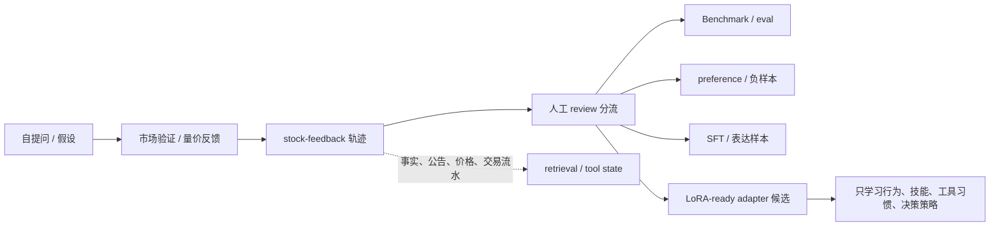
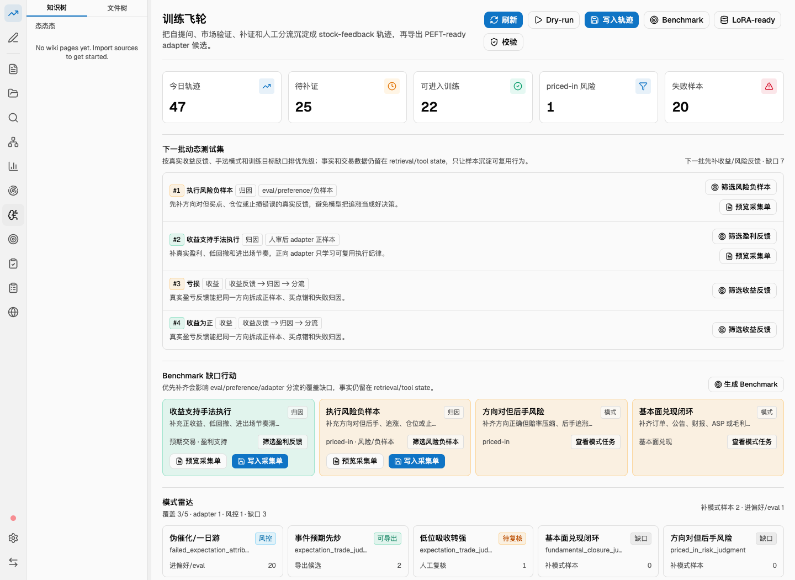
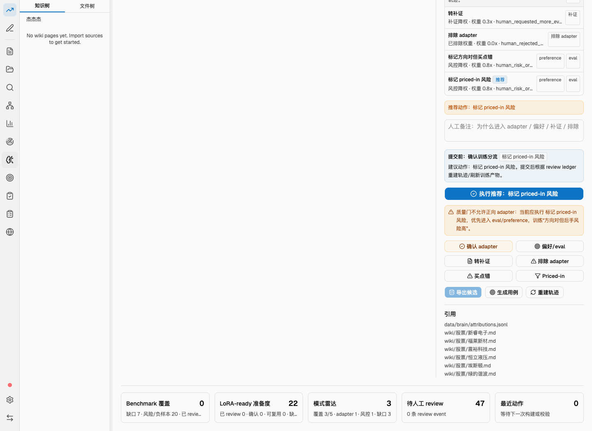
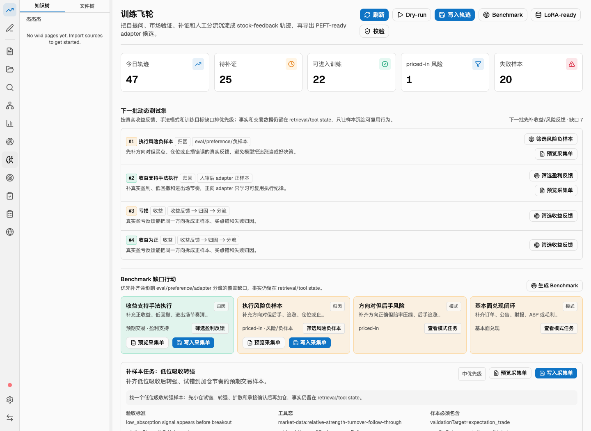
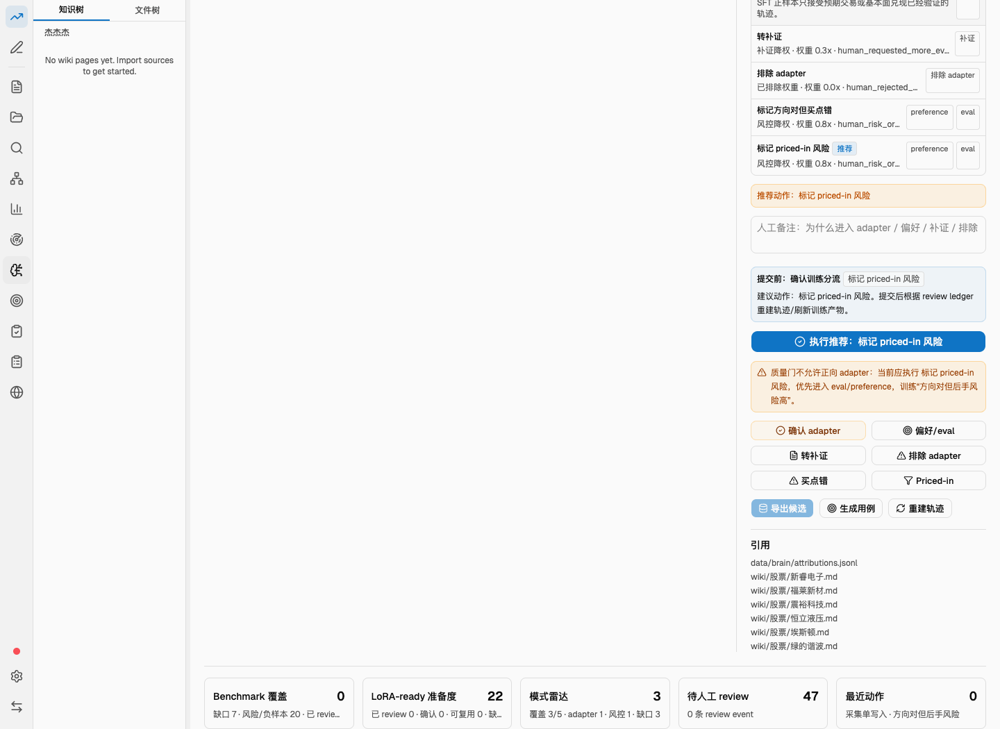

# 训练飞轮新手操作说明

> 适用页面：桌面应用左侧导航的 **训练飞轮**。
> 适用目标：把自提问、市场验证、补证、人工分流沉淀成 `stock-feedback` 轨迹，再生成 Benchmark 与 PEFT-ready / LoRA-ready 候选。
> 截图说明：本文截图使用当前项目真实 `stock-feedback` 数据作为基底，并额外加入一个 priced-in 演示样本用于说明分流逻辑。实际数字以你的应用页面为准。

## 一句话理解

训练飞轮不是“把股票事实塞进 LoRA”。它做的是：



核心边界：

- 原始事实、公告正文、财报、价格行、交易流水：留在 `retrieval/tool state`、`sourceRefs`、`price SQL`、`wiki/raw/facts`。
- LoRA / adapter 候选：只沉淀可复用的行为、技能、工具习惯和决策策略。
- 人工 review 是闸门：没有人审或证据不足，不应把样本直接当成高质量正向 adapter。

## 快速上手流程

第一次使用只按这 8 步走：

1. 打开桌面应用，进入项目。
2. 左侧点击 **训练飞轮**。
3. 点顶部 **刷新**，确认当前数据状态。
4. 点 **Dry-run**，预览会生成哪些轨迹，不写文件。
5. 点 **写入轨迹**，把轨迹写入 `.llm-wiki/stock-feedback/**`。
6. 在轨迹表中选一条样本，右侧查看推荐动作。
7. 按右侧推荐做人工分流，例如 **确认 adapter**、**偏好/eval**、**转补证**、**Priced-in**。
8. 点 **Benchmark**、**LoRA-ready**、**校验**，完成训练产物闭环。

最短闭环：

```text
刷新 -> Dry-run -> 写入轨迹 -> 选样本 -> 人审分流 -> Benchmark -> LoRA-ready -> 校验
```

## 页面总览



页面从上到下分为 6 个区域：

1. 顶部操作栏：刷新、Dry-run、写入轨迹、Benchmark、LoRA-ready、校验。
2. 指标卡片：今日轨迹、待补证、可进入训练、priced-in 风险、失败样本。
3. 下一批动态测试集：告诉你下一批最该补哪些训练能力。
4. Benchmark 缺口行动：告诉你 Benchmark 目前缺哪些 case。
5. 模式雷达：按市场手法模式看覆盖情况。
6. 轨迹表 + 右侧详情：选择样本、查看证据、做人工分流。

## 顶部按钮怎么用

| 按钮 | 作用 | 是否写文件 | 什么时候点 |
|---|---|---:|---|
| **刷新** | 重新读取 status、list、review queue | 否 | 页面数据不更新、刚跑完 CLI、刚完成 review 后 |
| **Dry-run** | 预览将生成的轨迹 | 否 | 第一次使用、怕写错、想先看结果 |
| **写入轨迹** | 把派生轨迹写入 `.llm-wiki/stock-feedback/**` | 是 | Dry-run 看起来正常后 |
| **Benchmark** | 生成/刷新动态测试用例 | 通常是 | 已有轨迹或人审后 |
| **LoRA-ready** | 导出 adapter 候选 manifest | 通常是 | 已有人审样本，想生成训练候选清单 |
| **校验** | 校验轨迹、Benchmark、LoRA-ready 与引用一致 | 否 | 每轮闭环最后一步 |

使用建议：

- 新手不要一上来点 LoRA-ready。先点 Dry-run，再写入轨迹，再做人审。
- 点 **写入轨迹** 不是写正式 `wiki/` 或 `raw/`，只写训练飞轮自己的 `.llm-wiki/stock-feedback/**`。
- 点 **校验** 如果报错，先处理错误，不要继续导出。

## 顶部 5 个指标是什么意思

| 指标 | 含义 | 数字高说明什么 | 下一步 |
|---|---|---|---|
| **今日轨迹** | 当前可读到或可派生的 stock-feedback 轨迹数量 | 自提问/验证数据已经进入飞轮 | 继续筛选和人审 |
| **待补证** | 证据不足、不能直接作为高质量样本的数量 | 缺公告、订单、财报、sourceRefs 或验证路径 | 点样本右侧 **转补证** 或生成采集单 |
| **可进入训练** | 已经具备一定训练价值的样本 | 有机会进入 eval / preference / adapter | 逐条人工 review |
| **priced-in 风险** | 方向对但赔率压缩、后手风险高的样本 | 风控样本更丰富 | 优先进入 preference/eval，不要直接正向 adapter |
| **失败样本** | 预期失败、一日游、无承接或被证伪样本 | 负样本/失败归因丰富 | 进入偏好/eval 或失败归因 |

判断口诀：

```text
可进入训练 不等于 一定进 adapter。
priced-in / 失败样本 更适合 eval、preference、负样本。
待补证 先补证，不提权。
```

## 下一批动态测试集


这个区域回答一个问题：**下一批测试集最应该补什么？**

常见卡片含义：

| 卡片类型 | 意义 | 推荐动作 |
|---|---|---|
| **执行风险负样本** | 当前缺少方向对但买点错、仓位错、止损慢等真实反馈 | 点 **筛选风险样本** 或生成采集单 |
| **收益支持手法执行** | 当前缺少正收益、低回撤、进出场节奏清楚的样本 | 点 **筛选盈利反馈** 或写入采集单 |
| **亏损/收益归因分流** | 需要把同一方向拆成正样本、买点错、失败归因 | 优先做人审分流 |
| **缺口任务** | 某个训练目标或市场模式覆盖不足 | 预览/写入采集单 |

按钮解释：

| 按钮 | 作用 |
|---|---|
| **筛选风险样本** | 把列表切到风险/负样本，方便找 priced-in、买点错、失败承接 |
| **筛选盈利反馈** | 把列表切到收益支持样本，方便找可复用正向执行策略 |
| **预览采集单** | 只生成采集任务预览，不写入 |
| **写入采集单** | 写入补样本任务，后续可记录 collection result |
| **生成 Benchmark** | 直接刷新 Benchmark 覆盖 |

## Benchmark 缺口行动

Benchmark 是“考试题库”。它不训练模型，而是用来检查模型或策略是否真的会判断。

缺口行动的意义：

- 如果缺 **priced-in 风险验证**，说明系统还不够会考“方向对但买点靠后”。
- 如果缺 **低位吸收转强**，说明系统还不够会考“低位试错、转强、扩散、承接”。
- 如果缺 **基本面兑现闭环**，说明系统还不够会考“订单、公告、财报、ASP、毛利率兑现”。
- 如果缺 **收益/亏损反馈**，说明系统还不能区分“判断对但没赚钱”和“手法真的可复用”。

操作顺序：

1. 看缺口卡片。
2. 点 **预览采集单** 看系统需要什么证据。
3. 如果合理，点 **写入采集单**。
4. 补证完成后记录 collection result。
5. 点 **写入轨迹** 重建轨迹。
6. 点 **Benchmark** 刷新题库。

## 模式雷达怎么看

模式雷达按市场手法模式统计覆盖情况。它不是涨跌排名，而是训练能力分布。

常见模式：

| 模式 | 含义 | 适合进入哪里 |
|---|---|---|
| **伪催化/一日游** | 没扩散、没承接、预期失败或被证伪 | preference / eval / 负样本 |
| **事件预期先炒** | 事实未落地前，资金先交易预期 | adapter 候选或 eval，需人审 |
| **低位吸收转强** | 低位吸收后转强，适合研究试错到加仓节奏 | adapter 候选或 SFT |
| **基本面兑现闭环** | 订单、公告、财报、ASP、毛利率兑现 | fundamental_validated 样本 |
| **方向对但后手风险** | 方向对，但赔率压缩、追涨风险大 | preference / eval / 风控样本 |

颜色/状态理解：

- **可导出**：有一定正向 adapter 候选价值，但仍要看人审。
- **风控**：更适合风险控制、负样本、preference/eval。
- **待复核**：需要人工确认事实边界或分流。
- **缺口**：当前样本不足，先补样本。

## 轨迹表怎么筛选

轨迹表左上有训练目标筛选：

| 筛选 | 看什么 |
|---|---|
| **全部** | 所有轨迹 |
| **预期交易** | 市场先交易预期、短期扩散和承接验证 |
| **基本面兑现** | 订单、公告、财报、ASP、毛利率等兑现验证 |
| **priced-in** | 方向对但赔率压缩、后手风险 |
| **失败归因** | 预期失败、无承接、一日游、被证伪 |

收益反馈筛选：

| 筛选 | 看什么 |
|---|---|
| **全部反馈** | 不限制收益反馈 |
| **盈利支持** | 正收益、低回撤、执行节奏较清楚 |
| **风险/负样本** | 亏损、回撤、买点错、仓位错 |
| **待结算** | 还没有足够收益反馈 |

轨迹表列含义：

| 列 | 含义 |
|---|---|
| **训练目标** | 这条样本要训练什么能力 |
| **假设 / 标的** | 来源假设、问题、股票 |
| **质量门** | 当前证据状态，如 `expectation_validated`、`needs_evidence` |
| **去向** | 预计进入 eval、preference、adapter、SFT 等 |

## 右侧详情与人审分流



右侧详情是最重要的操作区。你要在这里完成“这条样本到底进入哪里”的人工判断。

详情通常包含：

- 质量门解释：为什么推荐进入 adapter、偏好、补证或负样本。
- 提交前预览：每个动作会导致什么路由。
- 推荐动作：系统认为最合理的操作。
- 人工备注：你为什么这么分流。
- 分流按钮：提交 review event。
- 引用：这条轨迹依赖哪些 sourceRefs。

## 人审按钮逐一解释

| 按钮 | 什么时候点 | 结果 |
|---|---|---|
| **执行推荐** | 新手优先点这个；它会执行系统推荐动作 | 写入对应 review event |
| **确认 adapter** | 只有样本确实代表可复用行为/技能，且质量门允许时 | 进入 adapter 候选 |
| **偏好/eval** | 方向对但风险高、失败归因、负样本、比较样本 | 进入 preference/eval |
| **转补证** | 缺 sourceRefs、公告、订单、财报、价格验证或事实边界 | 进入补证路线 |
| **排除 adapter** | 这条不适合正向 adapter，或有事实写入 LoRA 风险 | 排除正向 adapter |
| **买点错** | 方向可能对，但买点、仓位、止损导致结果差 | 风控/偏好/eval |
| **Priced-in** | 方向已被市场验证，但赔率压缩、后手追涨风险高 | 风控/偏好/eval |
| **导出候选** | 当前样本已满足 adapter 条件，想导出候选 | 触发 LoRA-ready 导出 |
| **生成用例** | 想把该类样本进入 Benchmark | 生成 Benchmark case |
| **重建轨迹** | review、补证或结果回流后，需要刷新轨迹 | 重新生成轨迹 |

重要提示：

- **确认 adapter** 被锁住不是 bug。它表示当前质量门或 PEFT 边界不允许正向 adapter。
- 看到橙色提示“质量门不允许正向 adapter”时，优先执行推荐动作，例如 `标记 priced-in 风险`。
- 人审后通常还要点 **重建轨迹** 或顶部 **LoRA-ready**，让 review ledger 进入新批次。

## 各类样本应该怎么处理

### 1. 预期交易样本

特征：

- 没有订单/公告/财报也可以。
- 但要有时间戳、扩散、相对强度、成交额、后续承接等市场验证。
- 质量门通常是 `expectation_validated`。

推荐操作：

1. 检查 sourceRefs 和市场验证。
2. 如果是可复用交易判断路线，点 **确认 adapter**。
3. 如果只是个股事实或偶然行情，点 **偏好/eval** 或 **转补证**。

### 2. 基本面兑现样本

特征：

- 必须有订单、公告、财报、ASP、毛利率等兑现证据。
- 短期上涨不能单独算基本面兑现。
- 质量门应是 `fundamental_validated`。

推荐操作：

1. 看 evidenceState 是否有基本面证据。
2. 没证据时点 **转补证**。
3. 证据完整后再考虑 **确认 adapter** 或 SFT。

### 3. priced-in 风险样本

特征：

- 方向判断可能对。
- 但市场已经先涨，赔率变差。
- 后手追涨、承接变弱、回撤扩大。

推荐操作：

1. 优先点 **Priced-in** 或 **执行推荐：标记 priced-in 风险**。
2. 通常进入 **偏好/eval**，训练“方向对但买点错”。
3. 不要直接点 **确认 adapter**，除非你明确要训练风控策略而不是正向追涨。

### 4. 失败样本

特征：

- 一日游。
- 无承接。
- 预期被证伪。
- 没有扩散或后续确认。

推荐操作：

1. 点 **偏好/eval**。
2. 或点 **排除 adapter**，避免把失败催化当正样本。
3. 保留失败样本价值，用来训练“伪催化识别”和“失败归因”。

### 5. 待补证样本

特征：

- 质量门是 `needs_evidence`。
- 缺 sourceRefs、公告、订单、财报、价格验证或收益反馈。

推荐操作：

1. 点 **转补证**。
2. 在补证任务里写清楚需要什么证据。
3. 补证后记录 collection result。
4. 再点 **重建轨迹**、**Benchmark**、**LoRA-ready**。

## 补证与回流怎么做



补证不是写正式 wiki 页面，而是把“还缺什么证据”变成可追踪任务。

典型流程：

1. 在动态测试集、Benchmark 缺口或详情页点击 **预览采集单**。
2. 确认采集目标，例如 `priced_in_late_entry`、`fundamental_closure_confirmation`。
3. 点击 **写入采集单**。
4. 找到证据后，在 collection result 里填写：
   - `confirmed` / `refuted` / `insufficient`
   - evidence refs
   - summary
5. 写入结果后点 **重建轨迹**。
6. 再做人审分流。
7. 刷新 Benchmark / LoRA-ready。

结果类型：

| result | 含义 | 下一步 |
|---|---|---|
| `confirmed` | 证据支持该补样本目标 | 重建轨迹，再 review |
| `refuted` | 证据反驳该目标 | 转失败归因或负样本 |
| `insufficient` | 仍然证据不足 | 保持补证，不提权 |

## 底部状态怎么看



底部 5 个状态面板用于判断闭环是否真的跑通：

| 面板 | 含义 | 正常进展 |
|---|---|---|
| **Benchmark 覆盖** | 已生成多少 Benchmark 批次，以及缺口数量 | 从 0 变成正数，缺口下降 |
| **LoRA-ready 准备度** | adapter 候选数量、已审数量、批次状态 | review 后候选更清楚 |
| **模式雷达** | 市场模式覆盖数量 | 缺口模式逐步减少 |
| **待人工 review** | 还有多少轨迹没人工分流 | 人审后下降 |
| **最近动作** | 最近一次写入/导出/校验的结果 | 用来确认按钮是否生效 |

真实闭环跑通后，你应该看到：

- `persistedTrajectories` 从 0 增加。
- `reviewEvents` 从 0 增加。
- `reviewedTrajectories` 从 0 增加。
- `benchmarkBatches` 从 0 增加。
- `loraReadyBatches` 从 0 增加。

## 新手最推荐的操作路线

### 路线 A：先跑最小闭环

适合第一次确认系统能跑通。

```text
刷新
Dry-run
写入轨迹
选 1 条 expectation_validated 样本
执行推荐 / 确认 adapter
Benchmark
LoRA-ready
校验
```

### 路线 B：补一个 priced-in 缺桶

适合训练“方向对但买点错”。

```text
模式雷达 / Benchmark 缺口
找到 方向对但后手风险
预览采集单
写入采集单
补证并记录 collection result
写入轨迹
选新轨迹
Priced-in / 偏好-eval
Benchmark
LoRA-ready
校验
```

### 路线 C：补基本面兑现闭环

适合训练“订单/公告/财报兑现判断”。

```text
筛选 基本面兑现
找 needs_evidence 样本
转补证
补订单/公告/财报/ASP/毛利率证据
记录 confirmed collection result
重建轨迹
确认 fundamental_validated
再考虑 adapter / SFT
```

## 常见错误与处理

### 页面显示命令失败

处理顺序：

1. 看错误文本。
2. 点 **刷新**。
3. 如果仍失败，重启开发版应用。
4. 再跑 **校验**。

已知修复：

- `Missing value for --include-reviewed`：这是 Tauri 参数传递问题，已修成 `--include-reviewed true`。如果还看到旧错误，说明应用没有重启到最新 binary。

### LoRA-ready 是 0

常见原因：

- 还没有写入轨迹。
- 还没有人工 review。
- 样本是 `needs_evidence`、`priced_in_validated` 或 `disconfirmed_validated`，不应该进入正向 adapter。
- PEFT 边界认为候选会存原始事实。

处理：

1. 先写入轨迹。
2. 做 2-3 条人工 review。
3. 确认至少有 expectation_validated 或 fundamental_validated。
4. 再点 LoRA-ready。

### 确认 adapter 按钮不可点

这通常是正确行为。

原因可能是：

- 质量门不允许正向 adapter。
- 样本是 priced-in、失败样本或待补证。
- PEFT 边界不干净，可能把原始事实写进 adapter。

处理：

- 按推荐动作走。
- priced-in 点 **Priced-in** 或 **偏好/eval**。
- 失败样本点 **偏好/eval** 或 **排除 adapter**。
- 待补证点 **转补证**。

### Benchmark 还有缺口

Benchmark 缺口不是错误，而是提示你下一批该补什么。

处理：

1. 看缺口卡片。
2. 预览采集单。
3. 写入采集单。
4. 补证回流。
5. 重建轨迹。
6. 重新生成 Benchmark。

## CLI 对照表

如果你想确认 UI 背后发生了什么，可以用这些命令对照：

```bash
cd /Users/jiegege/Downloads/trading-review-wiki-0.10.311
export PROJECT="/Users/jiegege/Desktop/杰杰杰"

npm --silent run codex:ingest -- stock-feedback status --project "$PROJECT"
npm --silent run codex:ingest -- stock-feedback build-trajectories --project "$PROJECT"
npm --silent run codex:ingest -- stock-feedback build-trajectories --write --project "$PROJECT"
npm --silent run codex:ingest -- stock-feedback review-queue --include-reviewed true --limit 20 --project "$PROJECT"
npm --silent run codex:ingest -- stock-feedback bench --write --project "$PROJECT"
npm --silent run codex:ingest -- stock-feedback export-lora-ready --quality-gate high_confidence --write --project "$PROJECT"
npm --silent run codex:ingest -- stock-feedback verify --project "$PROJECT"
```

人工 review CLI 示例：

```bash
npm --silent run codex:ingest -- stock-feedback review \
  --trajectory-id <trajectory_id> \
  --action approve_for_adapter \
  --reviewer jiegege \
  --note "确认这是可复用判断路线；事实留在 retrieval/tool state" \
  --write \
  --project "$PROJECT"
```

## 每次操作后的检查清单

写入轨迹后：

- [ ] 顶部 `今日轨迹` 有数量。
- [ ] 轨迹表能选中样本。
- [ ] 右侧详情有质量门和推荐动作。

人审后：

- [ ] 页面出现 review 已提交或刷新提示。
- [ ] 不要重复点同一个 review。
- [ ] 先重建轨迹或刷新 LoRA-ready。

Benchmark 后：

- [ ] 底部 Benchmark 覆盖批次增加。
- [ ] 缺口行动减少或更具体。
- [ ] 风险/负样本进入 eval/preference。

LoRA-ready 后：

- [ ] LoRA-ready 准备度更新。
- [ ] adapter 候选不包含原始事实。
- [ ] sourceRefs 仍指向 retrieval/tool state。

校验后：

- [ ] 没有 errors。
- [ ] warnings 可以逐条看，但不要忽略事实边界类 warning。
- [ ] 再点刷新确认状态。

## 最容易做错的三件事

1. 把短期上涨当成基本面兑现。
   基本面兑现必须有订单、公告、财报、ASP、毛利率等证据。

2. 把 priced-in 样本点成确认 adapter。
   方向对但后手风险高，优先进入 eval/preference，训练模型别追涨。

3. 以为 LoRA-ready 会记住股票事实。
   不会，也不应该。LoRA-ready 只保存可复用行为和决策策略，事实仍靠 retrieval/tool state。

## 推荐日常节奏

每天或每轮研究后：

1. 点 **刷新** 看当前状态。
2. 点 **写入轨迹** 更新市场反馈轨迹。
3. 先处理 **priced-in 风险** 和 **失败样本**，避免系统误把坏样本当正样本。
4. 再处理 **可进入训练** 的正向候选。
5. 把 **待补证** 变成采集任务，不要强行提权。
6. 点 **Benchmark** 更新考试题。
7. 点 **LoRA-ready** 更新候选清单。
8. 点 **校验** 收口。

这样跑出来的训练飞轮才是闭环：

```text
假设提出 -> 市场反馈 -> 证据补齐 -> 人审分流 -> Benchmark 检验 -> LoRA-ready 候选 -> 校验 -> 下一轮样本缺口
```
