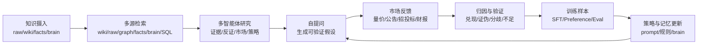
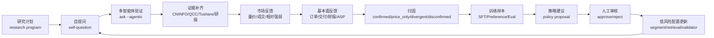

# 递归自训练交易 AI 框架报告

## 1. 总体目标

本项目的长期目标不是做一个单次问答工具，而是把 Trading Review Wiki 升级为一个可验证、可迭代、可工程化运行的交易研究智能体系统。

目标闭环可以概括为：



最终要形成的不是不可审计的黑箱，而是一套可交易的研究与决策链摘要能力：AI 能自己提出问题，给出可验证标准，等待市场反馈，做归因，沉淀经验，再反过来改进下一轮提问和研究策略。

## 2. 现阶段已有能力

### 2.1 CLI 工程底座

当前分支已经把原先集中的 `scripts/codex-ingest-lib.mjs` 拆成模块化目录：

- `scripts/codex-ingest/core/`：路径、JSONL、文件、hash、frontmatter、provider、脱敏等通用能力。
- `scripts/codex-ingest/ask/`：普通 ask、agentic ask、market validator、stock daily SQL、topic segment。
- `scripts/codex-ingest/data-source/`：QCC、CNINFO、Tushare、数据源状态与凭证读取。
- `scripts/codex-ingest/brain/`：长期记忆、预测、验证、自训练样本相关入口。
- `scripts/codex-ingest/ingest/`：资料摄入、staged manifest、apply 写入。
- `scripts/codex-ingest/company-research/`：公司深度研究、模型和候选页产物。
- `scripts/codex-ingest/cli/`：参数解析、帮助文本、command handler router。

兼容边界保持不变：

- `scripts/codex-ingest.mjs` 仍是唯一 CLI 入口。
- `scripts/codex-ingest-lib.mjs` 继续作为 facade re-export，保护测试和外部脚本。
- 现有 Codex skills 继续调用原命令，不需要改 skill。

### 2.2 多源检索问答

`ask` 现在是只读研究入口，支持：

- `wiki`：正式知识页。
- `raw`：原始资料。
- `graph`：基于 wikilink / related / source 的有界图谱扩展。
- `facts`：Temporal Facts v1 当前事实。
- `brain`：长期预测、验证、纠错记忆。
- `stock-price`：本地股票日线 SQL。

输出仍保持六章节结构：

- 结论
- 证据链
- 分歧/反证
- 后续验证
- 交易含义
- 引用来源

这个结构是后续样本生成和评测的基础，因为每次回答都可以被拆成结论、证据、反证、验证计划和交易动作假设。

### 2.3 多智能体并发 ask

已实现 `ask --agentic`，默认并发度为 3。运行角色包括：

- 证据研究：抽取支持 thesis 的 wiki/raw/facts 证据。
- 反证审计：专门寻找矛盾、证伪、证据缺口和过度外推。
- 市场验证：读取 Market Validation、SQL hits、量价和候选池表现。
- 交易策略：把证据转成交易框架、观察点和风险边界。
- 裁判员 adjudicator：综合成功 agent 的输出，形成原 ask 六章节答案。

已具备的工程能力：

- 单 agent 失败时继续。
- 全部 agent 失败时整体失败。
- 失败角色、证据缺口、置信度影响需要显式出现在最终答案。
- agent run 默认写入 `.llm-wiki/agent-runs/<timestamp>-ask/`。
- manifest 记录 `runId/query/roles/status/sourceRefs/model/timing` 等字段。
- 支持 `--agent-concurrency`、`--agent-timeout-ms`、`--no-agent-artifacts`。
- 支持 `--profile local-max`，在本地高性能机器上提高 agentic ask、self-question loop 回归/导出校验、export-samples verify 的有界并发默认值；显式并发参数仍优先。

这一步是递归系统的第一块骨架：每一次 agentic ask 都不仅是答案，也是未来训练、评测和归因的数据源。

### 2.4 主题细分候选池与 Market Validation

Market Validator 已经不只是从问题里机械抽股票，而是支持主题识别和 segment 候选池：

- 先识别主题。
- 查询可维护的 segment registry。
- 命中配置时按细分环节构建候选池。
- 未配置时回退到普通候选池，并提示 `未配置细分环节`。

当前已有方向包括：

- 光互联/光纤链：光纤光缆、MPO 连接器、跳线、FAU、特种光纤等。
- PCB 链：高速多层板、HDI、服务器背板、ABF/BT 载板、低 Dk-Df 覆铜板、树脂、玻纤布、HVLP 铜箔、设备、化学品等。

Market Validation 的定位是回答：

- 这条线是订单兑现，还是叙事扩散？
- 哪些细分环节被市场确认？
- 哪些只是被龙头或泛材料股带偏？
- 量价、成交额、相对强弱是否支持 thesis？

### 2.5 摄入与正式写入链路

摄入链路已经完整：

```text
prepare -> api-run -> finalize -> apply dry-run -> apply --write
```

工程边界：

- `raw/` 不被摄入流程改写。
- `apply --write` 是正式 wiki 写入入口。
- 没有 `--write` 一律 dry-run。
- 写入前会生成 manifest、coverage review、apply report。
- 对 source archive、正式 wiki 页、index、overview、daily log 做结构化写入。

这保证了后续自训练系统不会绕过正式写入边界。

### 2.6 Temporal Facts 与概念治理

已有 Temporal Facts v1：

- `data/facts/temporal_edges.jsonl` 记录会过期、会被替代、会被证伪的事实。
- ask 默认只使用 active/current facts。
- `--include-invalidated` 可以追查历史矛盾、替代链、证伪记录。
- `temporal-facts audit` 可以从现有 wiki 提取 predicate、alias、tag、缩写候选。
- ask 已只读加载 active policy registry，把已批准策略作为回答 guardrail 注入普通 prompt 和 agentic evidence ledger。

已有 Concept Governance：

- `concepts audit` 扫描重复概念、别名冲突、父子/切片关系。
- 高置信 `sameAs/auto` 可用于摄入路由。
- 父子概念和交易切片默认只提示，不自动吞并。

这些能力用于防止长期知识库越用越乱。

### 2.7 Brain、Daily Loop、Self-Train 初版

已有 MPA/GBrain-like 基础：

- `brain remember`：记录纠错、偏好、guardrail、thread。
- `brain status`：查看预测和验证账本状态。
- `brain resolve`：关闭一条记忆或纠错。
- `daily-loop`：盘前生成问题/预测，盘后验证 pending prediction；盘前 planner 和 answerer 会只读加载 active policy，把已批准的补证/降置信规则注入下一轮研究问题和答案审计。
- `market-validate`：针对 prediction 和 stock 做量价验证。
- `self-question`：生成 `self-question-v1` 结构化问题，默认 dry-run，`--write` 时只写 `data/brain/questions.jsonl`。
- `self-question` planner 已读取 active policy registry，并把 active policy 摘要写进 run planner 审计；daily-loop 返回结果也会记录 `counts.activePolicies` 与 `questionPlanner.activePolicies`，写入的 daily-research report 会列出 `## Active Policies`。
- `self-question loop`：编排 generate/validate/attribute/evidence/policy/policy-regression/policy-regression-execute/policy-regression-feedback/policy-regression-remediation/policy-regression-patches/policy-regression-apply/policy-regression-verify/gate-event/self-train/export/export-verify 阶段，默认写 `.llm-wiki/self-question-runs/*/manifest.json` 审计产物；`evidence/policy/policy-regression/policy-regression-execute/policy-regression-feedback/policy-regression-remediation/policy-regression-patches/policy-regression-apply/policy-regression-verify/gate-event/export-verify` 是 opt-in stage，不改变默认 loop；`policy-regression-execute` 和 `policy-regression-verify` 只有显式传 `--execute-policy-regressions` 才运行命令，否则只记录计划；两者都会写入 verdict，未执行为 `planned`，命令失败、超时、断言 failed/skipped 为 `needs_remediation`，全部通过为 `passed`；`export-verify` 只读校验训练导出 ledger/jsonl/manifest，缺失或数量不一致会写入 `needs_remediation` verdict；loop 顶层 `status` 会随 regression/export gate 聚合为 `planned` 或 `needs_remediation`，并在 `gateSummary` 暴露 recommended next stages，但不会把可修复回归或导出完整性问题当作 CLI 异常抛出；`gate-event` 只有显式纳入 stage 且 `--write` 时，才把 open planned/needs_remediation gateSummary 追加到 `data/brain/self_training_events.jsonl` 作为后续自训练可消费事件；`policy-regression-apply` 只有显式传 `--apply-policy-regression-patches` 才应用已审阅 patch candidate，否则记录 skipped stage；manifest 包含 run/stage 级 `status/timing/counts/outputs/writePolicy/gateSummary`，阶段失败时会先写失败 manifest 和脱敏错误，再让 CLI 非零退出并打印审计路径。
- `self-question validate`：读取 planned self-question，按股票池和验证窗口生成市场反馈记录，默认 dry-run，`--write` 时只写 `data/brain/validations.jsonl`。
- `self-question attribute`：读取 self-question market-feedback validation，生成归因记录，默认 dry-run，`--write` 时只写 `data/brain/attributions.jsonl`。
- `self-question evidence`：把 `price_only` attribution 里的基本面缺口收敛成 pending evidence task queue，默认 dry-run，`--write` 时只写 `.llm-wiki/evidence-tasks/`。
- `self-question evidence resolve`：把补证任务结果写成 `self-question-evidence-result-v1`，默认 dry-run，`--write` 时只写 `data/brain/evidence_results.jsonl`。
- `self-question policy`：从重复出现的 attribution gap 生成可审阅 policy proposal，默认 dry-run，`--write` 时只写 `.llm-wiki/policy-proposals/`。
- `self-question policy approve/reject/list`：显式审阅 proposal；approve 在 `--write` 时写 `data/brain/policies.jsonl` active policy，approve/reject 都写 `data/brain/self_training_events.jsonl` review event。
- `self-question policy regression`：把 active policy 转成 ask/daily-loop/training-sample 三类回归 case，默认 dry-run，`--write` 时只写 `.llm-wiki/policy-regressions/`。
- `self-question policy regression evaluate`：读取 regression case 输出并评估为 passed/failed/skipped，默认 dry-run，`--write` 时只写 `.llm-wiki/policy-regression-results/`。
- `self-question policy regression execute`：读取 regression case，默认只计划；带 `--execute` 时按 case command 执行并内嵌评估，生成 `planned/passed/needs_remediation` verdict，`--write` 时只写 `.llm-wiki/policy-regression-executions/`；显式 `--concurrency` 可并发执行本地 case command 且保持结果顺序稳定；同一能力也可通过 `self-question loop --stages policy-regression,policy-regression-execute --execute-policy-regressions --policy-regression-concurrency <n>` 编排。
- `self-question policy regression feedback`：读取 execution run，把 command failed / timeout / skipped / assertion failed 转成 proposed feedback，默认 dry-run，`--write` 时只写 `.llm-wiki/policy-regression-feedback/`；同一能力也可通过 `self-question loop --stages policy-regression-execute,policy-regression-feedback` 编排。
- `self-question policy regression remediation`：读取 feedback run，把 proposed feedback 转成可审阅修正建议，默认 dry-run，`--write` 时只写 `.llm-wiki/policy-regression-remediations/`；输出包含 execution repair、case output repair、policy/prompt patch 三类提案，但不自动改 active policy、prompt 或训练样本。
- `self-question policy regression remediation approve/reject`：显式审阅 remediation proposal，`--write` 时只写 `data/brain/self_training_events.jsonl` review event；审核通过也只进入审计账本，不自动应用 prompt、active policy 或训练样本变更。
- `self-question policy regression remediation patches`：读取已批准且 `autoApplied=false` 的 remediation review event，导出人工应用前的 patch candidate，默认 dry-run，`--write` 时只写 `.llm-wiki/policy-regression-patches/`；候选包会标记 `applyMode=manual_required` 和 `autoApplied=false`。
- `self-question loop --stages policy-regression-patches`：可把 patch candidate 导出纳入总审计 manifest，记录 `policyRegressionPatchCandidates` count 和 output；该 stage 仍不自动 apply。
- `self-question policy regression remediation patches apply`：显式应用 prompt/policy 类 patch candidate，默认 dry-run，`--write` 时只追加 active policy revision 和 apply event；新的 `promptGuardrails/regressionAssertions` 会进入后续 ask、daily-loop 和 self-question planner 的 active policy 上下文。
- `self-question loop --stages policy-regression-apply`：可把受控 patch apply 纳入总审计 manifest；未传 `--apply-policy-regression-patches` 时只记录 skipped stage，传入后才复用 patch apply 能力追加 active policy revision 和 apply event。
- `self-question loop --stages policy-regression-apply,policy-regression-verify`：可在受控应用后立刻重新导出 active policy regression 并执行或计划复验，确认新 revision 的 `promptGuardrails/regressionAssertions` 已进入回归样本；复验 verdict 会把失败/跳过断言导向 `policy-regression-feedback` 和 `policy-regression-remediation`。
- `self-question loop --stages export,export-verify --write`：可在导出训练样本后立刻校验本轮 ledger/jsonl/manifest 是否存在且数量一致；坏批次会进入 `needs_remediation` gate，后续可由 `gate-event/self-train` 消费。
- `self-train`：根据 validations、attribution 和 gate event 做 dry-run 动作建议；`price_only` attribution 会触发基本面补证任务，open `self-question-loop-gate` 会触发 `R9-open-regression-gate` 回归门控动作并给出下一步 loop 命令建议；在同一 `self-question loop` dry-run 中，`gate-event` 的内存事件也会传给后续 `self-train` 展示 R9 动作，但不会写 brain；`self-train --write` 按稳定 action fingerprint 追加去重，避免重复运行污染 `self_training_events.jsonl`；`self-train actions` 可只读列出持久化动作及最新 approved/rejected/resolved/open 状态；`self-train next` 可按优先级只读列出下一批 open 动作；`self-train plan` 可把下一批 open 动作转成非执行计划包，`--write` 时只写 `.llm-wiki/self-training-plans/`；`self-train plan list` 可只读回看历史计划包；`self-train review` 可追加 `self-training-action-review`，把动作标记为 approved/rejected/resolved，后续建议默认过滤已审阅动作。
- `export-samples`：导出 `sft/preference/eval` 样本；已支持从 self-question、self-question market-feedback validation、attribution、self-training-action 和 agent-runs 生成样本，并可通过 `--quality-gate` 筛选训练门槛。每批导出都会在 JSONL 旁写 `training-sample-export-manifest-v1`，记录样本数、质量门分布、来源分布、high-confidence 可用数和 sampleRefs，为后续训练批次审计、回归比较和数据集治理留痕；同时追加 `.llm-wiki/exports/training/export-ledger.jsonl` 跨批次索引，`export-samples list` 可只读查询并按 kind、qualityGate、limit 筛选，`export-samples verify` 可在训练前以有界并发只读校验 ledger/jsonl/manifest 是否存在且数量一致。同一天重复导出会自动追加时间戳/序号，避免覆盖旧批次。

已有写入边界：

- 盘前只写 `data/brain/predictions.jsonl` 和 `.llm-wiki/daily-research/`。
- 盘后只写 `data/brain/validations.jsonl` 和 `.llm-wiki/wiki-feedback/`。
- `self-question evidence --write` 只写 `.llm-wiki/evidence-tasks/`，不改 `wiki/`、`raw/`、`data/brain/`。
- `self-question evidence resolve --write` 只写 `data/brain/evidence_results.jsonl`，不回写正式 wiki/raw，也不改原 attribution。
- `self-question policy --write` 只写 `.llm-wiki/policy-proposals/`，生成 proposed 状态，不自动激活策略。
- `self-question policy approve/reject --write` 只写 `data/brain/policies.jsonl` 和 `data/brain/self_training_events.jsonl`；ask 与 daily-loop 会只读加载 active policy，但不会自动改写策略、正式 wiki 或原始资料。
- `self-question policy regression --write` 只写 `.llm-wiki/policy-regressions/`，不改 `wiki/`、`raw/`、`data/brain/`。
- `self-question policy regression evaluate --write` 只写 `.llm-wiki/policy-regression-results/`，不改 `wiki/`、`raw/`、`data/brain/`。
- `self-question policy regression execute --write` 只写 `.llm-wiki/policy-regression-executions/`，不改 `wiki/`、`raw/`、`data/brain/`；真实执行必须显式传 `--execute`。
- `self-question policy regression feedback --write` 只写 `.llm-wiki/policy-regression-feedback/`，不改 `wiki/`、`raw/`、`data/brain/`；输出是 proposed feedback，不自动改 active policy。
- `self-question policy regression remediation --write` 只写 `.llm-wiki/policy-regression-remediations/`，不改 `wiki/`、`raw/`、`data/brain/`；输出是 proposed remediation，不自动改 active policy、prompt 或训练样本。
- `self-question policy regression remediation approve/reject --write` 只写 `data/brain/self_training_events.jsonl`，不改 `wiki/`、`raw/`、`data/brain/policies.jsonl`、prompt 或训练样本；review event 会标记 `autoApplied=false`。
- `self-question policy regression remediation patches --write` 只写 `.llm-wiki/policy-regression-patches/`，不改 `wiki/`、`raw/`、`data/brain/`、active policy、prompt 或训练样本；patch candidate 仍需后续人工 apply。
- `self-question loop --stages policy-regression-patches --write` 也只写 `.llm-wiki/policy-regression-patches/` 和 `.llm-wiki/self-question-runs/` manifest，不改 `wiki/`、`raw/`、`data/brain/` 或 active policy。
- `self-question policy regression remediation patches apply --write` 只追加 `data/brain/policies.jsonl` 和 `data/brain/self_training_events.jsonl`，不改 `wiki/`、`raw/`、历史 policy、prompt 源码或训练样本；重复 apply 默认幂等跳过。
- `self-question loop --stages policy-regression-apply --apply-policy-regression-patches --write` 只追加 `data/brain/policies.jsonl` 和 `data/brain/self_training_events.jsonl`，并写 `.llm-wiki/self-question-runs/` manifest；不传 `--apply-policy-regression-patches` 时不会写 brain，只记录 skipped。
- `self-question loop --stages policy-regression-verify --write` 只写 `.llm-wiki/policy-regressions/`、`.llm-wiki/policy-regression-executions/` 和 `.llm-wiki/self-question-runs/` manifest，不改 `wiki/`、`raw/` 或 `data/brain/`；真实执行仍需 `--execute-policy-regressions`。
- `self-question loop --stages policy-regression,policy-regression-execute,gate-event --write` 只把 open planned/needs_remediation gateSummary 追加到 `data/brain/self_training_events.jsonl`，并写 `.llm-wiki/self-question-runs/` manifest；不改 `wiki/`、`raw/`、active policy、prompt 或训练样本。
- `self-train plan --write` 只写 `.llm-wiki/self-training-plans/` 非执行计划包，不改 `wiki/`、`raw/` 或 `data/brain/`。
- self-train 默认 dry-run，不自动写正式训练结论。

### 2.8 公司深度研究与数据源接口

已有能力：

- `company-research --deep --plugin-led` 生成公司深研证据包、底表、财务模型、插件主报告、发布门禁和候选 wiki 页。
- 写入范围限制在 `.llm-wiki/company-research/`。
- 不直接写 `raw/` 或正式 `wiki/`。
- Data Analytics 先接管表格、口径、单位、tie-out、公式重算风险和证据覆盖。
- Public Equity Investing 作为主分析师，基于证据包和 Data Analytics 结果直接生成分段主报告；如果完整性校验不通过，会再生成 `plugin-led/plugin-led-company-report-complete.md`，最终路径以 `plugin-led/plugin-led.json` 的 `outputs.pluginLedReport` 为准。
- `deep-company-report.md` 会复制/落同一份插件主报告，兼容旧 reviewer 和 skill。
- Investment Banking 只在并购、定增、可转债、重组、融资等触发项出现，或显式 `--force-investment-banking-review` 时参与。

数据源方向：

- Tushare：用户已有，可继续接入行情、财务、基础资料。
- CNINFO：用于公告、定期报告、重大事项。
- 企查查招投标：用于订单、招标、中标、客户线索。
- 本地 stock daily SQL：用于量价验证和交叉检查。

当前风险：

- 外部源真实 smoke 可能卡在网络或 provider 等待，需要 per-provider timeout、进度日志和失败降级。
- QCC/CNINFO/Tushare 凭证要统一进入安全凭证加载层，不能出现在日志、manifest 或命令历史里。
- `publish-readiness.json` 只负责发布门禁，`manual_needed/provider_needed` 等阻断项出现时必须保持 blocked，不能把插件主报告伪造成 ready。

### 2.9 专业插件能力层

新增三类专业插件能力层，作为主程序之上的分析和交付框架，而不是新的数据源。公司深研 V2 已采用“混合插件优先”：主程序负责数据采集、证据包、底表、写入边界和发布门禁；Data Analytics / Public Equity Investing 直接做深度分析；Investment Banking 只在交易事项触发时参与。

| 插件 | 系统定位 | 主要用途 | 边界 |
|---|---|---|---|
| Data Analytics | 数据分析和验证工厂 | 数据质量、模型校验、指标诊断、横向对比、可视化、dashboard、TAM/SAM/SOM | 不提供 Wind/FactSet/Choice；需要主程序提供 SQL、Excel、JSON、wiki/raw 等输入 |
| Public Equity Investing | 买方股票研究框架 | tearsheet、投资 thesis、财报分析、估值、催化剂、仓位风险、退出条件 | 只在明确股票投资研究时调用，不替代证据抓取 |
| Investment Banking | 交易、并购、融资、估值建模框架 | 并购、重组、定增、债务融资、交易条款、稀释、业绩承诺、模型 tie-out | 只在交易结构场景调用，不用于普通资料整理 |

最佳分工：

```text
数据源层：
CNINFO / Tushare / QCC / Tavily / wiki / raw / SQL / Excel

主程序证据层：
evidence-pack.json / financials.json / document-extract.json / business-breakdown.json / financial-model-v2

结构化处理层：
Data Analytics -> plugin-led/data-analytics-model-analysis.md

公司股票研究层：
Public Equity Investing -> plugin-led/plugin-led-company-report.md
完整性修复(必要时) -> plugin-led/plugin-led-company-report-complete.md

特殊交易事项层：
Investment Banking -> transaction/capital-markets trigger only

主程序落地产物：
company-research --deep --plugin-led
financial-model-v2.xlsx
deep-company-report.md
evidence-ledger.json
publish-readiness.json
wiki-change-candidates.md
```

进入递归闭环时，它们只能作为可审计的辅助能力：

```text
self-question
-> ask --agentic
-> market validation / company-research / data-source
-> company-research --deep --plugin-led
-> Data Analytics 模型和证据质控
-> Public Equity Investing 主报告
-> Investment Banking 特殊交易事项分析
-> attribution
-> experiment score
-> policy proposal
-> 人工审核
```

这三类插件不能绕过主程序写入边界：Phase 5A 只能生成审计材料和待审核建议；Phase 6 以后也只能在人工批准、低风险白名单和回归门通过后进入配置改动。详细说明见 [`docs/专业插件能力层集成说明.md`](专业插件能力层集成说明.md)。

### 2.10 测试与验证状态

当前阶段已验证：

- 全量测试通过：11 个测试文件，294 条测试。
- 生产 build 通过。
- `git diff --check` 通过。
- CLI smoke 覆盖 ask、agentic、ingest、apply、daily-loop、market-validate、brain、self-train、export-samples、data-source status 等核心命令。
- skills wrapper 兼容：`tw-ask.sh`、`tw-mpa.sh` 仍可用。

## 3. 目标系统的数据对象

后续递归系统需要把现在的松散文件进一步标准化成几个核心对象。

| 对象 | 作用 | 当前基础 | 后续增强 |
|---|---|---|---|
| Evidence | 证据 | wiki/raw/facts/brain/SQL hits | 统一 evidence ledger、来源可靠性评分 |
| Question | 自提问 | `self-question-v1`、daily-loop question | question schema、novelty、验证计划 |
| Hypothesis | 可交易假设 | prediction jsonl | 细分环节、时间窗、失效条件 |
| Validation | 市场反馈 | validations jsonl、market-validate、self-question validate | 多源交叉、成交额/公告/订单/财报闭环 |
| Attribution | 归因 | `self-question-attribution-v1`、self-train dry-run 初版 | 兑现/证伪/运气/外部冲击分类 |
| Memory | 长期经验 | brain memory | 可检索 guardrail、策略规则版本 |
| Sample | 训练样本 | export-samples 初版 | SFT/Preference/Eval 质量门控 |
| Policy | 下一轮策略 | prompt/skill/规则 | 可版本化、可回归测试 |

## 4. 当前进度判断

当前分支已经不再是“只会问答的知识库 CLI”。它已经进入 **Phase 5A：Trading Autoresearch Lite**。

Phase 5A 的定义是：

```text
深度问题
-> ask --agentic 多智能体分析
-> 市场/SQL/证据验证
-> experiment ledger 记录
-> policy proposal 生成
-> 人工审核
```

关键边界：

- AI 可以提出“系统应该怎么改”。
- AI 不自动改 prompt。
- AI 不自动改 segment 配置。
- AI 不自动写正式 `wiki/` 或 `raw/`。
- AI 不自动交易。
- 所有实验和建议默认写 `.llm-wiki/**` 审计目录。

当前已具备的能力按阶段归类如下：

| 阶段 | 能力 | 当前状态 | 说明 |
|---|---|---|---|
| Phase 1 | CLI 工程化拆分 | 已完成主体 | 保留兼容入口，内部模块化 |
| Phase 2 | 多智能体研究 | 已落地 | `ask --agentic` 并发运行证据、反证、市场、策略角色 |
| Phase 3 | 市场验证与 segment 候选池 | 已落地第一版 | 已支持主题识别、细分候选池、缺配置提示 |
| Phase 4 | self-question / validation / attribution / export-samples | 已有闭环雏形 | 能生成问题、验证、归因、导出训练样本 |
| Phase 5A | Autoresearch proposal | 已落地第一版 | `program/score/ledger/proposal`，只提出改进建议 |
| Phase 5B | 人工审核队列和低风险 patch 候选 | 部分已有 | patch candidate / remediation / review 已有基础，还需产品化 |
| Phase 6+ | 低风险配置应用、模拟交易、真实交易建议 | 未进入 | 必须等数据源、评估器和回归门足够稳定 |

当前最应该坚持的判断：

> 这套系统已经可以开始做“可审计研究实验”，但还不能做“自动策略应用”或“自动交易”。

## 5. 最终闭环目标

最终闭环不是让 AI 自己无限改自己，而是让每一次研究都变成可验证资产。

目标形态：



这个闭环里，每一轮必须回答五个问题：

- 问题是否足够深：有没有明确产业链环节、时间窗、验证指标、证伪条件？
- 证据是否足够硬：有没有公告、订单、招投标、财报、产业数据，而不是只有叙事？
- 市场是否验证：候选池是否同步走强，成交额和相对强弱是否支持？
- 归因是否可信：涨对了是因果链对，还是风格、情绪、指数或大票带动？
- 经验是否可复用：能否转成 policy、segment、validator 参数或 evidence priority？

## 6. 数据源缺口

当前最大短板不是“模型不会说”，而是“缺少足够硬的产业和基本面反馈”。要把系统从 Phase 5A 推到 Phase 8/9，必须补齐以下数据层。

### 6.1 P0：市场与财报基础数据

| 数据 | 具体字段 | 用途 | 当前状态 |
|---|---|---|---|
| A 股日线 | open/high/low/close、volume、amount、turnover、pct_chg | 市场验证基础 | 本地 SQL 已有，Tushare 可补 |
| 复权行情 | 前复权/后复权价格、停复牌、涨跌停 | 回测和验证窗口 | 需要标准化 |
| 指数/行业行情 | 主题指数、申万/中信行业、可比公司 basket | 区分个股 alpha 与板块 beta | 需要补强 |
| 财务三表 | 利润表、资产负债表、现金流 | 财报闭环 | Tushare/CNINFO 可接 |
| 财务衍生指标 | 毛利率、净利率、ROE、现金转换、存货周转、应收周转 | 判断订单是否兑现成利润 | 需要统一 schema |
| 分产品/分地区收入 | 产品收入、毛利率、地区收入、前五客户 | 验证具体细分环节 | 需要从年报/半年报抽表 |

建议优先接：

- [Tushare](https://tushare.pro/)：日线、财务、基础资料和部分特色数据。
- [CNINFO 巨潮资讯](https://www.cninfo.com.cn/) / [深证信数据服务平台](https://webapi.cninfo.com.cn/)：公告、年报、半年报、季报、重大合同、投资者关系。

### 6.2 P1：订单、招投标、交付

这是判断“订单兑现还是叙事扩散”的关键层。

| 数据 | 具体字段 | 用途 |
|---|---|---|
| 招标公告 | 采购方、项目名称、预算、产品规格、数量、投标截止日 | 识别潜在需求 |
| 中标公告 | 中标方、中标金额、产品、交付周期、客户 | 验证订单落地 |
| 合同公告 | 合同金额、客户、产品、履约期限、收入确认方式 | 把叙事转成订单证据 |
| 产能/交付 | 产线、扩产、良率、产能利用率、交付节奏 | 判断收入兑现速度 |
| 合同负债/预收 | 合同负债、预收款、订单 backlog | 判断未确认收入 |

建议优先接：

- [企查查招投标 API](https://openapi.qcc.com/dataApi/958)：按项目名称、关键字、地区、信息类型等检索招投标信息。
- [天眼查开放平台招投标](https://open.tianyancha.com/open/887)：可作为 QCC 的备选或交叉验证。
- CNINFO 公告：重大合同、日常经营合同、风险提示、定期报告里的订单和客户披露。

### 6.3 P1：公司级深度研究数据

公司研究不能只看股价和新闻，需要形成“公司-产品-客户-财务”的映射。

| 数据 | 字段 | 用途 |
|---|---|---|
| 产品矩阵 | 产品名、规格、代际、对应客户、收入占比 | 判断是否真受益 |
| 客户结构 | 前五客户、客户集中度、CSP/设备商/模组厂关系 | 判断可兑现性 |
| 供应链位置 | 上游材料、下游客户、国产替代位置 | 判断弹性和议价 |
| 产能数据 | 产线、设计产能、扩产进度、资本开支 | 判断交付瓶颈 |
| 利润弹性 | ASP、单位成本、毛利率、良率 | 判断收入能否变利润 |
| 风险项 | 价格下降、客户导入失败、认证周期、库存 | 反证审计 |

这部分由 `company-research --deep --plugin-led` 承接：主程序先产出证据包、底表和模型，Data Analytics 做模型和证据质控，Public Equity Investing 直接形成主报告，Investment Banking 只在交易事项触发时参与。后续仍需要增强：

- 年报/半年报 PDF 表格抽取。
- 公司公告段落级引用。
- IR 问答和投资者关系记录。
- 同业横向对比模板。
- 财务模型和证据 ledger 的字段标准化。

### 6.4 P2：产业深度报告和专家纪要

产业深度报告解决的是“空间测算”和“产业节奏”，不是单家公司事实。

AI 数据中心相关最缺的字段包括：

| 主题 | 关键字段 |
|---|---|
| 光纤/光缆 | 单柜光纤芯数、单集群用量、AOC/DAC/光纤替代路径、800G/1.6T 节奏 |
| 光模块/CPO | 端口数、光模块数量、CPO 渗透率、硅光/薄膜铌酸锂/FAU/透镜用量 |
| 连接器/MPO | MPO 规格、跳线数量、单柜价值量、客户认证周期 |
| PCB | 高速多层板层数、背板价值量、HDI/ABF/BT/低 Dk-Df 材料占比 |
| 服务器电源 | 单机柜功率、PSU/BBU/HVDC 渗透率、客户规格 |
| 液冷 | 冷板/CDU/快接头/泵阀价值量、渗透率、交付节奏 |
| 存储 | HBM/SSD/存储服务器配置、单机价值量、供应商份额 |

候选产业数据源：

- [LightCounting](https://www.lightcounting.com/)：光通信、AI 集群、数据中心和光网络研究；其报告覆盖光模块等产品的需求预测。
- [Dell'Oro Group](https://www.delloro.com/)：数据中心、网络、光传输等市场研究；其 AI back-end networks 和 optical transport 报告覆盖收入、端口出货、ASP、厂商份额等维度。
- [TrendForce](https://www.trendforce.com/research/category/Semiconductors/AI%20Server_HBM_Server?page=23)：AI Server/HBM/半导体与光通信产业研究。
- [Prismark Partners](https://www.prismark.com/)：电子产业、PCB、材料、EMS 和供应链咨询。
- 券商深度报告、专家纪要、产业链会议纪要：用于补“参数”和“节奏”，但必须标注为二级证据，不能直接当订单。

### 6.5 P2：模拟交易和执行数据

进入 Phase 8 前必须补齐交易验证数据，否则只能做研究闭环，不能做交易闭环。

| 数据 | 用途 |
|---|---|
| 分钟线/盘口 | 模拟买卖点、滑点、流动性约束 |
| 涨跌停/停牌 | A 股可交易性约束 |
| 手续费/印花税/冲击成本 | 回测净收益 |
| 仓位和持仓日志 | 验证策略建议是否可执行 |
| 买卖理由和执行记录 | 区分研究对错与交易执行对错 |
| 风险预算 | 单票、行业、主题、回撤、流动性限制 |

## 7. 数据接入顺序

建议不要一次性买很多源。正确顺序是先把验证闭环跑通，再买能提高闭环质量的数据。

### 第一批：必须立刻稳定

- 本地 A 股日线 SQL：作为所有市场反馈的真值源。
- Tushare：补日线、财务、基础资料、复权、交易日历。
- CNINFO：公告、财报、重大合同、风险提示。
- QCC 招投标：订单和客户线索。

验收标准：

- `data-source status` 能报告每个源状态。
- 每个源都有 timeout、脱敏、失败降级。
- 每条证据能落到 evidence ledger，带 sourceRef、时间、原文链接或 hash。

### 第二批：提高产业深度

- 光通信：LightCounting / Dell'Oro / TrendForce。
- PCB：Prismark / 券商行业深度 / 公司公告抽表。
- AI Server 和网络：Dell'Oro AI back-end networks、TrendForce AI Server/HBM。
- 专家纪要：只作为参数和假设来源，必须经过公告/订单/财报验证。

验收标准：

- 每个产业参数都有 `sourceType=industry_report|expert_call|broker_report`。
- 产业参数进入模型时必须记录日期、版本、适用范围。
- 不能把产业报告的预测直接当公司订单。

### 第三批：交易闭环数据

- 分钟线、盘口、成交明细。
- 真实持仓、模拟持仓、委托成交日志。
- 交易成本、滑点、涨跌停约束。
- 指数/行业/风格因子。

验收标准：

- 模拟交易引擎可复现每一次信号。
- 回测严格禁止未来函数。
- 每个交易建议都有 evidence pack 和 risk pack。

## 8. Phase 5-9 路线图

### Phase 5：AI 提出改进建议，不自动应用

当前阶段。目标是让 AI 从实验账本里提出“应该改什么”，但不自己改。

允许 AI 建议：

- 补哪些 segment 配置。
- 哪些 market validator 参数需要调整。
- 哪些 evidence task 优先级应该提高。
- 哪些 agent 角色经常失败。
- 哪些问题类型经常缺财报/订单证据。
- 哪些回答应该降低置信度。

不允许 AI 做：

- 自动改 prompt。
- 自动改正式 wiki。
- 自动改核心代码。
- 自动交易。
- 自动把 proposal 变成 active policy。

产物：

```text
.llm-wiki/agent-runs/**
.llm-wiki/experiments/experiment-ledger.jsonl
.llm-wiki/policy-proposals/**
```

进入 Phase 6 的门槛：

- 至少 20 次真实主题实验进入 ledger。
- 每次实验能追溯到 agent run、validation、attribution。
- proposal 必须带 evidenceRefs、evidenceGaps、riskLevel、autoApplyAllowed=false。
- `autoresearch score` 固定，不允许 AI 自己改评分标准。

### Phase 6：人工批准后应用低风险配置改动

目标：人批准后，系统可以应用低风险配置，不再只停留在建议。

低风险配置包括：

- `segment_config`：新增或调整主题细分候选池。
- `market_validator_params`：窗口、候选池权重、成交额阈值、相对强弱阈值。
- `evidence_task_priority`：公告、招投标、财报、产业报告的补证优先级。
- `retrieval_policy`：某类问题优先查哪些源。
- `answer_guardrail`：缺少订单/财报时必须降置信度。

仍然不允许：

- 自动改核心代码。
- 自动改正式 wiki。
- 自动改真实交易动作。
- 自动把训练样本设为高置信。

工程要求：

- 所有配置改动必须生成 patch candidate。
- patch candidate 必须带 reviewer、apply event、rollback key。
- 应用后必须跑 regression。
- regression 失败则进入 remediation，不进入 active。

进入 Phase 7 的门槛：

- 至少 10 个低风险配置通过人工批准、应用、回归、复验。
- 没有出现越权写 `wiki/`、`raw/` 或泄露 secret。
- 配置回滚路径验证通过。

### Phase 7：多次验证阈值后，部分低风险策略自动应用

目标：在严格门控下，允许系统自动应用一小部分低风险策略。

可自动应用范围必须很窄：

- 已存在主题下新增同类 segment alias。
- evidence priority 的排序调整。
- validator 的非破坏性阈值微调。
- 已通过多轮 regression 的回答 guardrail。

自动应用条件：

- 同类 proposal 至少出现 3 次。
- 最近 N 次 regression 全部通过。
- 没有 high severity remediation。
- 只写受控配置或 `data/brain/policies.jsonl` revision。
- 自动应用必须能一键回滚。
- 自动应用后必须立刻跑 post-apply regression verify。

明确禁止：

- 自动改 prompt 主体。
- 自动改 agent role 定义。
- 自动删 evidence source。
- 自动写正式 wiki/raw。
- 自动生成或执行交易动作。

进入 Phase 8 的门槛：

- 自动应用只发生在低风险白名单内。
- 每次自动应用都有审计记录和 rollback record。
- 自动应用后的研究质量在固定 eval 上优于 baseline。

### Phase 8：模拟交易闭环验证

目标：从研究闭环进入交易闭环，但仍然只做模拟。

新增对象：

| 对象 | 说明 |
|---|---|
| Signal | 研究系统生成的观察/试错/加仓/减仓信号 |
| Paper Order | 模拟委托 |
| Paper Fill | 模拟成交，含滑点和成交约束 |
| Position | 模拟持仓 |
| PnL Attribution | 收益归因，区分研究、择时、仓位、市场 beta |
| Risk Event | 回撤、流动性、集中度、涨跌停、黑天鹅 |

Phase 8 的核心不是收益率，而是验证：

- 研究信号是否可交易。
- 信号是否有时间优势。
- 证据强度是否与收益/回撤相关。
- 哪些 agent 角色最能提高交易质量。
- 哪些数据源对收益归因最有贡献。
- 哪些策略只是事后解释。

进入 Phase 9 的门槛：

- 至少覆盖 3 个完整市场阶段：强趋势、震荡、下跌。
- 至少 100 条模拟信号有完整 evidence pack。
- 无未来函数审计通过。
- 交易成本和流动性约束已计入。
- 负样本和失败样本保留在训练集中。

### Phase 9：受控真实交易建议，不直接自动交易

目标：系统可以生成真实交易建议，但不能直接下单。

允许输出：

- 观察清单。
- 试错建议。
- 仓位上限建议。
- 触发条件。
- 风险失效条件。
- 需要人工确认的买卖计划。

不允许输出：

- 自动下单。
- 绕过人工确认。
- 无证据链的强买卖建议。
- 无风险预算的仓位建议。
- 无撤退条件的持有建议。

每条真实交易建议必须包含：

```json
{
  "schema": "controlled-trading-advice-v1",
  "symbol": "示例股票",
  "thesis": "为什么看",
  "evidencePack": ["agentRun", "cninfo", "qcc", "financials", "marketValidation"],
  "counterEvidence": ["反证1", "反证2"],
  "trigger": "什么发生才行动",
  "invalidation": "什么发生就撤退",
  "positionLimit": "最大仓位",
  "liquidityCheck": "成交额/涨跌停/滑点",
  "reviewRequired": true,
  "autoTradeAllowed": false
}
```

Phase 9 的定位是“受控建议系统”，不是“自动交易系统”。

## 9. 后续实施顺序

### 9.1 现在立刻做：把 Phase 5A 用起来

每个深度问题都按这个流程跑：

```text
深度问题
-> ask --agentic
-> autoresearch ledger append
-> autoresearch proposal --write
-> 人工审核
```

建议先跑 5 条主题 lane：

- 光纤/光缆/CPO。
- PCB/低 Dk-Df/高速背板。
- AI 服务器电源/HVDC/BBU。
- 液冷/CDU/快接头。
- 存储/HBM/SSD/服务器。

目标不是马上赚钱，而是验证系统能不能把问题、证据、市场反馈和改进建议稳定串起来。

### 9.2 下一步工程：补数据源和 evidence task 执行器

优先做：

- `data-source cninfo filings/search/download/extract`。
- `data-source tushare financials/daily/adj-factor`。
- `data-source qcc-tenders batch`。
- `evidence task run`：读取 `.llm-wiki/evidence-tasks/**`，自动调用 CNINFO/QCC/Tushare 补证。
- `financial-table extractor`：年报/半年报 PDF 表格抽取。
- `industry-parameter registry`：单柜用量、ASP、渗透率、客户份额等参数库。

这一步完成后，`price_only` 样本才有机会升级成 `eligible/high_confidence`。

### 9.3 再下一步：Phase 6 人工批准应用低风险配置

把当前 proposal 变成可审阅、可应用、可回滚的配置 patch：

- proposal -> patch candidate。
- patch candidate -> human approve。
- approve -> apply controlled config。
- apply -> regression verify。
- verify failed -> remediation。
- verify passed -> active policy/config revision。

### 9.4 然后：Phase 7 小范围自动低风险应用

只允许在白名单内自动应用：

- segment alias。
- evidence priority。
- validator threshold。
- answer guardrail。

所有自动应用都要：

- 有阈值。
- 有回滚。
- 有 regression。
- 有审计。
- 有人工随时 kill switch。

### 9.5 最后：Phase 8/9 交易闭环

先做模拟交易：

- Signal ledger。
- Paper order/fill。
- Position ledger。
- PnL attribution。
- Risk report。

再做真实交易建议：

- 只建议，不自动下单。
- 每条建议必须带 evidence pack、risk pack、reviewRequired。
- 人工确认永远是最后一道门。

## 10. 固定评估器

递归自训练最大的风险是 AI 自己改评分标准，所以必须有 locked evaluator。

建议固定评分：

```text
score =
  market_feedback_score
+ evidence_closure_score
+ attribution_quality_score
+ novelty_score
+ tradability_score
- leakage_penalty
- complexity_penalty
- hype_without_order_penalty
- missing_financials_penalty
```

各项含义：

| 指标 | 含义 |
|---|---|
| `market_feedback_score` | 量价、成交额、相对强弱是否验证 |
| `evidence_closure_score` | 公告、订单、招投标、财报是否闭环 |
| `attribution_quality_score` | 能否解释为什么对/错 |
| `novelty_score` | 是否提出了非重复、可验证的新问题 |
| `tradability_score` | 是否可执行，是否考虑流动性和风险 |
| `leakage_penalty` | 是否使用未来数据或事后信息 |
| `complexity_penalty` | 是否为了复杂而复杂 |
| `hype_without_order_penalty` | 是否只有叙事，没有订单/财报 |
| `missing_financials_penalty` | 是否缺少财报闭环还给强结论 |

AI 可以优化实验对象，不能修改 evaluator。

## 11. 风险和防线

### 11.1 叙事扩散被误判成订单兑现

防线：

- 没有订单、招投标、公告或财报，不得标 `confirmed`。
- `price_only` 只能进入补证任务或 `needs_evidence` 样本。
- 反证 agent 必须检查“是否只有大票和泛材料股上涨”。

### 11.2 数据源失败被模型脑补

防线：

- 每个数据源必须有 status。
- 失败源写入 `sourceStatus=failed`。
- 最终答案必须披露失败源。
- 训练样本不能把失败源下的结论当正样本。

### 11.3 递归污染自己

防线：

- agent run 默认 `review_required`。
- 只有 validated + attributed + evidence confirmed 的样本才能进入 high confidence。
- policy 更新必须绑定 regression questions。
- 失败样本保留为负样本。

### 11.4 自动应用越权

防线：

- Phase 5 不自动应用。
- Phase 6 只人工批准后应用低风险配置。
- Phase 7 只允许白名单低风险策略自动应用。
- Phase 8 只模拟交易。
- Phase 9 只给受控建议，不直接下单。

## 12. 一句话结论

当前系统已经进入 **Phase 5A：AI 能提出改进建议，但不自动应用**。

下一步最重要的不是继续堆更多问答功能，而是补齐 `财报 + 公告 + 招投标 + 产业深度参数 + 模拟交易数据`，让每一次深度研究都能走完：

```text
自提问 -> 多智能体验证 -> 证据补齐 -> 市场反馈 -> 基本面反馈 -> 归因 -> 训练样本 -> policy proposal -> 人工审核 -> 低风险配置更新
```

只有这条链路稳定，后面的 Phase 6/7/8/9 才是工程系统；否则就只是更会写报告的模型。
